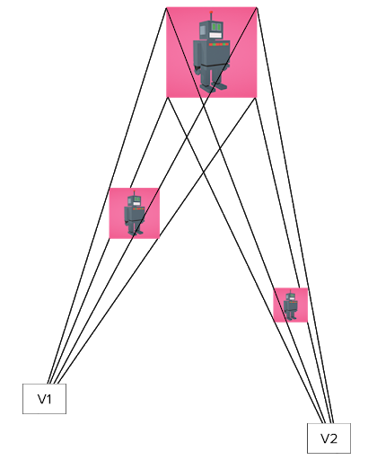
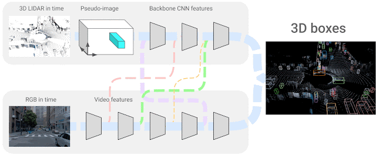
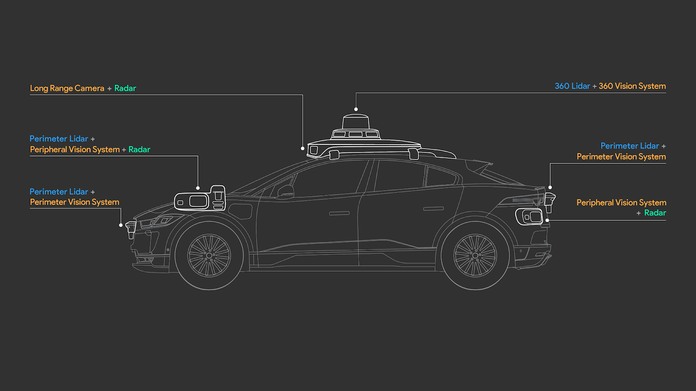
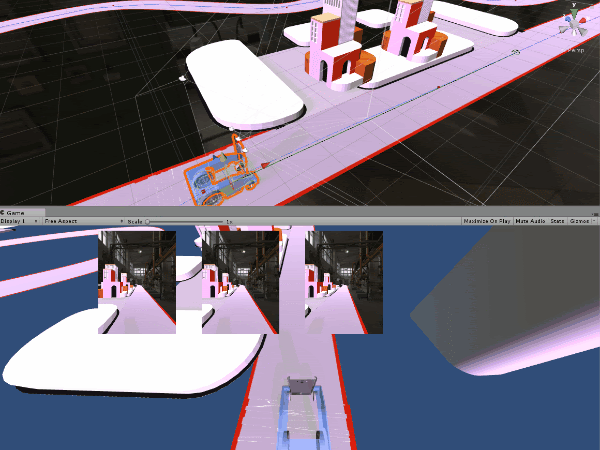
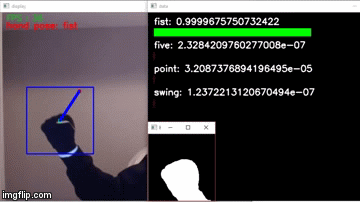

# Resources

## Links

- [Course Self-Driving Car Engineer no Degree](https://www.udacity.com/course/self-driving-car-engineer-nanodegree--nd0013)
- [TensorFlow Blog](https://blog.tensorflow.org/)
- [Google AI Blog](https://ai.googleblog.com/)
- [MediaPipe Solution(FaceMesh,HandTracking)](Solutions)

## AR

### Google Eye Distance Mesuring

[Link](https://ai.googleblog.com/2020/08/mediapipe-iris-real-time-iris-tracking.html)

### MediaPipe FaceMesh Web

- [Link](https://ai.googleblog.com/2019/03/real-time-ar-self-expression-with.html)

### MediaPipe Instant Motion Tracking 

- [Link](https://developers.googleblog.com/2020/08/instant-motion-tracking-with-mediapipe.html)

- [Google old Instant motion tracking](https://ai.googleblog.com/2018/02/the-instant-motion-tracking-behind.html)

### AR Solutions

### MeidaPiep on the Web

- [Link](https://developers.googleblog.com/2020/01/mediapipe-on-web.html)

## Self-Driving

- [Self Driving Car Simulator Unity Github](https://github.com/udacity/self-driving-car-sim)

- [4D-Net:Learning MultiModel Alignment for 3D and Image Inputs in Time]()

- [Introducing the 5th-generation Waymo Driver: Informed by experience, designed for scale, engineered to tackle more environments](https://blog.waymo.com/2020/03/introducing-5th-generation-waymo-driver.html)

### Pixelopolis self driving car-demo Unity

- [Link](https://blog.tensorflow.org/2020/07/pixelopolis-self-driving-car-demo-tensorflow-lite.html)

- [Vacumer Robot link](https://blog.tensorflow.org/2020/01/ecovacs-robotics-ai-robotic-vacuum.html)

## Robotics

- [Robot See,Robot Do Google AI](https://ai.googleblog.com/2022/02/robot-see-robot-do.html)

## Computer Vision

- [Google AI Blog:Scanned Objects by Google Research: A Dataset of 3D-Scanned Common Household Items](https://ai.googleblog.com/2022/06/scanned-objects-by-google-research.html)

- [Revisitin Mask Transformer from a Clustering Perspective Google AI Blog](https://ai.googleblog.com/2022/07/revisiting-mask-transformer-from.html)

## Tutorials

- [Computer Vison Python Kera OpenCV Tutorial Github](https://github.com/jrobchin/Computer-Vision-Basics-with-Python-Keras-and-OpenCV)

- [Awesome OpenCV Tutorials](https://pythonprogramming.net/loading-images-python-opencv-tutorial/)

## Log

> 9/19/22 10:57:40 AM

Decided to collect all open tabs and take notes on them.
Clearly taking longer then I expected
