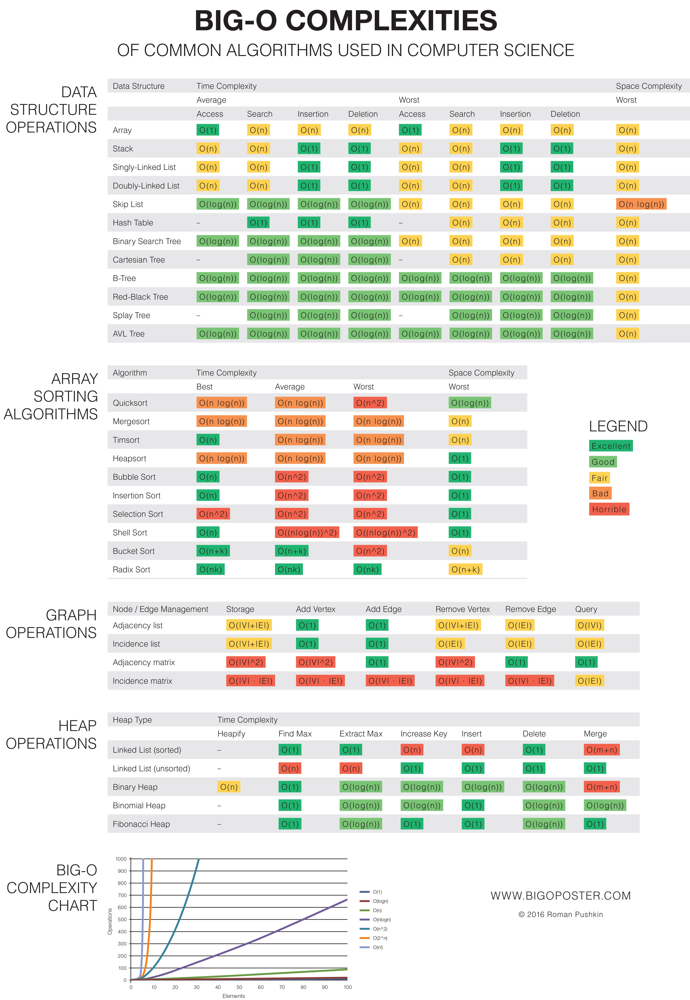
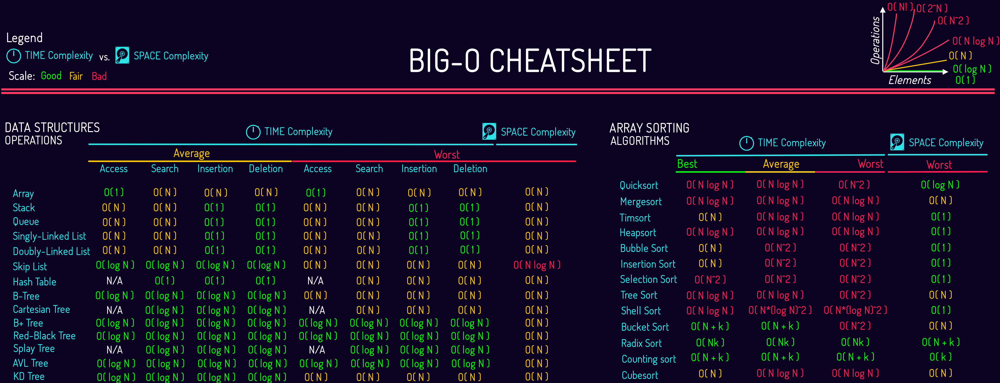
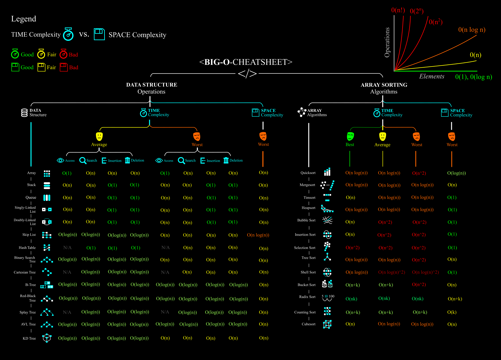

# Algorithms

## O(n)

## Sorting 

## Navigation

- A*
- ORCA

## A*

## ORCA
Optimal Reciprocal Collision Avoidance

[RVO2](https://gamma.cs.unc.edu/RVO2/downloads/) - is popular implementation with C# version

