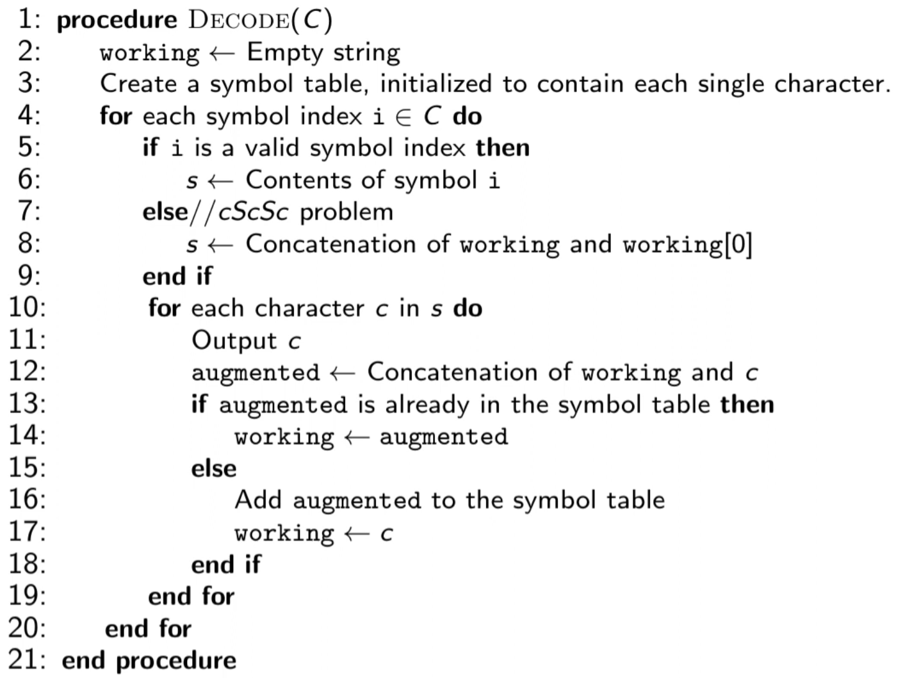

# Compression

[Princton Algos ref](http://localhost/pdf/Algos2Compression.pdf)

## Todo 

- Download canterbury corpus
- Test our compression with diffrent compressions.
- Create `CLI` to try our diffrent with Centerbery corpus data

### Tasks 

- Implement **LZW** 
    - coompression
    - decompression
- Implement **LZ78**
- Implement **LZW**
- BackRefrence script
- `A LASS; A LAD; A SALAD; ALASKA`
- Backreferceoveral
- LZSS vs LZ77 implementaionlgo\Algorithms Part II\Week 5 Data Compression\slides_55DataCompression.pdf

## Questions

- [ ] What is the last part of the Deflate Video
- [ ] What I am missins
-
- [ ] LZ78 vs LZW ?
- [ ] And of LZ family lecture ?
- [ ] LZW  Notes?

- [x] Good notes?

###  B

- [x] Basic explanation on LZ77 and Huffman coding
- [x] Test gzip in windows ? 
- [x] What the diffrence between LZ77 vs LZ78 vs LZSS

### C

- What is hex dump?
- LZMA vs LZMA2 vs BZIP2

## Compression 

- Centery corpus bzip
- UCDAVIC 7z

### UCDAVIC

- [Link](https://fiehnlab.ucdavis.edu/staff/kind/collector/benchmark/7zip-benchmark)

Input: **11 Gbyt** Windws XP VM

## LZ Family

### Family lines

**LZ77** - also known as **LZ1** 
**LZ78** - also knows as **LZ2**
**LZSS** - **L**emper **Z**iv **S**torer **S**zymanki
**LZW** -  **L**empel **Z**iv **W** 

### Terms 

 32K for **GZIP**

- **Backrefrecne** - Is refrecne that data was already there

- **Sliding Window** - Have limitation *Previous* and *Future* data.

- **Look Ahead** 

- **Backreference overlap** `2:6` 

- **CL** - **C**ode **L**ength

- **EOB** - **E**nd **O**f **B**lock marker

DEFLATE->LZSS->LZ77 
Length Distance pairs

Gif->LZW->LZ78->LZ77
Symbol table

LZMA->LZ77

### History 

Abraham Lempel - Is from lviv
Presented LZ77 (Lempel-Ziv in 1977)

Jacom Ziv - presented improved version
in 1978

**RLE** **R**un- **L**enght **E**ncoding

## LZW

- **W** stands for Welch
- `9-bit` to seprate symbols from refs 
- Standard dictionary of 256 symbols pre defined
- Had Dictionary
- Does not require headers
- **cScSc**
- 1984
- GIF 
- LZW has patent to it.

Was created in 1984. And it's caught on as a relatively simple and fast compression scheme. 

### Algo

#### Decompression

### Compress 

Ancient unix tool 

`compress input.txt`

`compress -d input.txt.Z`

### LZ77

Achives compression by replacing repeated occurences of data with references.

As well known as **LZSS**

## LZSS

**LZSS** - **L**empel- **Z**iv- **S**torer-Szymanski
That was created in 1982 by James A. Storer and Thomas Szymanski.

### LZ78

**LZ78** = **LZ77** + Dictiontary

The smae as **LZ77** but with dictionary.
Writen by the Abraham Lember and Jacom Ziv themself.

> from
L
`00000000 00000000 01111111 11111111 10000011 11111111`

> into

 data compresses into values of `17 15 5 10`. 

`00010001 00001111 00000101 00001010`

## Deflate

- [RFC 1951](https://datatracker.ietf.org/doc/html/rfc1951)

- Has better preformance
- gzip and zip
- no patent
- Test gzip in windows ? 
- Supported in gzip.

`.gz` - file stands for **GZIP** file
`.tar` - stands for multiple files

### Questions 

- [ ] Do I implent all links in video?  
- [ ] How to use gzstat.py ? 
- [ ] Where to find testing data for our algo? 
- [ ] What Unit test can I write

### Links

- [gzsta.py](scripts\gzstat.py)
- [Deflate White Paper](http://www.infinitepartitions.com/art001.html)
- [Youtube Lecture](https://youtu.be/oi2lMBBjQ8s)

### FileStructyre

### Block Type
	

### Literal/Length and Distance Symbols

### Back Distance

### LL Code

### Prefix 

### EOB 

### Block Types 

### Assignemtn

`gzip -d`

## Huffman coding

BADBAC = `101100101101`

- Huffman tree nodes.

### RLE

**RLE** **R**un- **L**enght **E**ncoding

`12W1B12W3B24W1B14W`-> `WWWWWWWWWWWWBWWWWWWWWWWWWBBBWWWWWWWWWWWWWWWWWWWWWWWWBWWWWWWWWWWWWWW`
