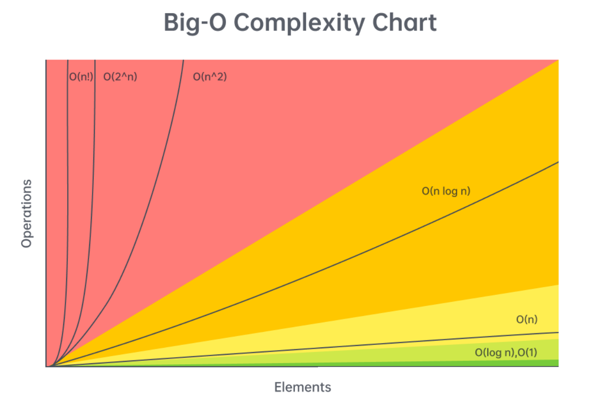
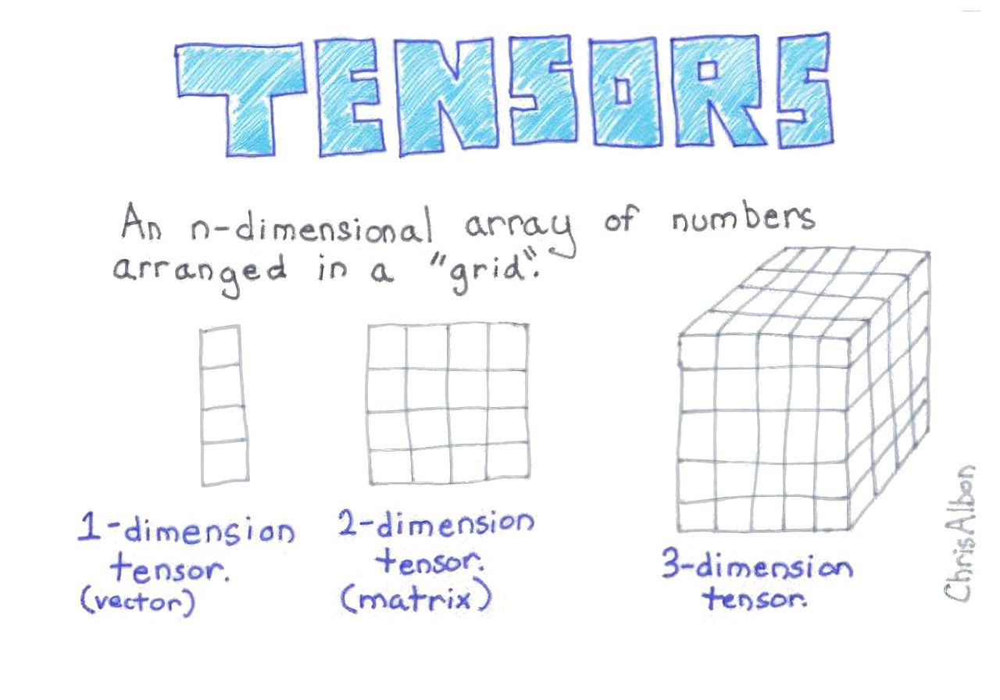
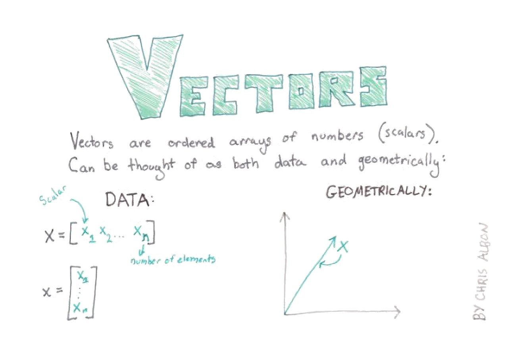
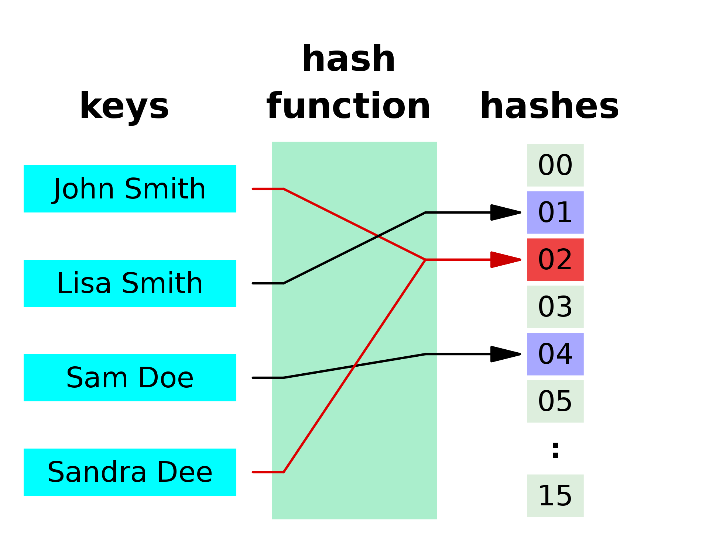
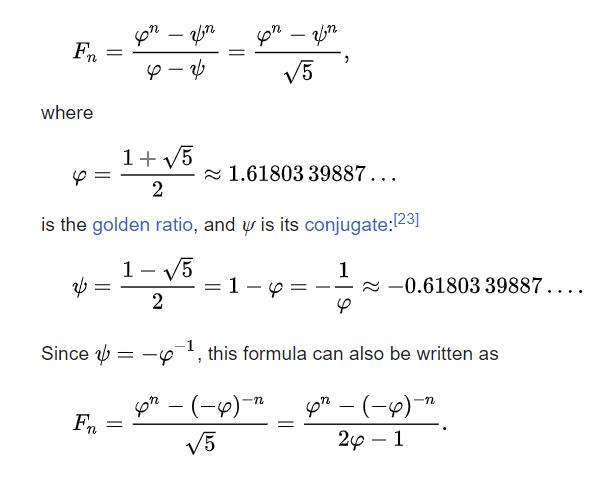
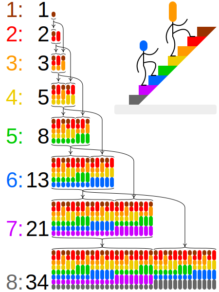
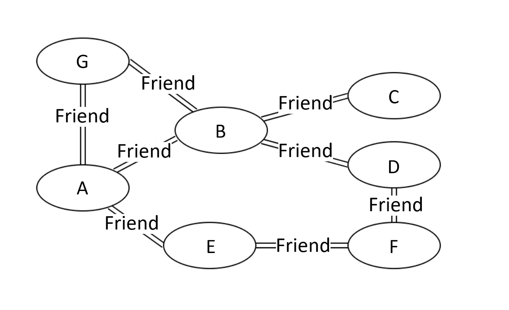
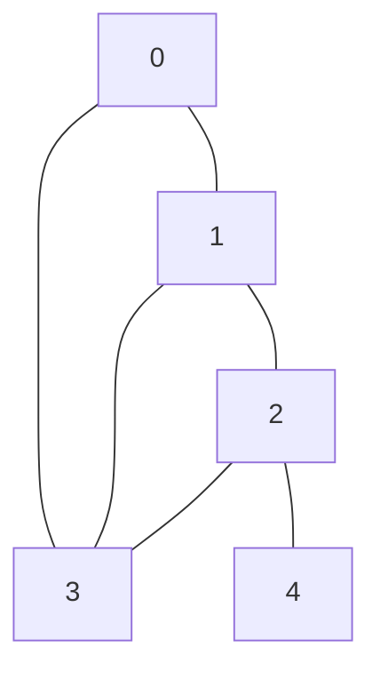

#Algorithms


### Big O



> MOre info about big O

#### Amortized Analyses

- [Amortized Analyses](https://en.wikipedia.org/wiki/Amortized_analysis)

> It's like when you have nested loop but it's not **O(N^2)**
**Robert Tarjan** in his 1985 paper Amortized Computational Complexity. 


## Outline

- [Arrays and Strings](#arrays-and-strings)
- [Hashmaps and Sets](#hashmaps-and-sets)
- [Matrix's](#matrix)
- [LinkedList](#linked-list)
- [Stack and Queue](#stack--queue) 
    - [Stack](#stack)
    - [Problems](#problems)
      - [20 Valid Parentheses](#20-valid-parentheses)
- [Queue](#queue)
- [Graph](#graph)
- [Greedy](#greedy)
- [Dynamic programming](#dynamic-programming)
    - [Types](#types)
- [Code Snipets](#code-snipets)


## Links

- [LeetCode Top Interview Questions](https://tinyurl.com/38hh47up)
- [LeetCode DS&Algo Crash Course](https://tinyurl.com/yvrv5znb)
- [NeetCode 150](https://neetcode.io/practice)
- [Tech Interview Handbook](https://yangshun.github.io/tech-interview-handbook/)

## Courses

### LeetCode Algo&DSA

**25-50 hours** - To complete the course

[Course link](https://tinyurl.com/yvrv5znb)


## Arrays and Strings

### TwoPointers

- [LeetCode](https://tinyurl.com/2ru2cjuj)

#### Appliance 

1. Simple two pointers
2. Two arrays


##### Check if Palindrome

```python
def check_if_palindrome(s):
    left = 0
    right = len(s) - 1

    while left < right:
        if s[left] != s[right]:
            return False
        left += 1
        right -= 1

    return True
```

#### Is Subsequence

```python
def combine(arr1, arr2):
    ans = []
    i = j = 0
    while i < len(arr1) and j < len(arr2):
        if arr1[i] < arr2[j]:
            ans.append(arr1[i])
            i += 1
        else:
            ans.append(arr2[j])
            j += 1

    while i < len(arr1):
        ans.append(arr1[i])
        i += 1

    while j < len(arr2):
        ans.append(arr2[j])
        j += 1

    return ans
```


### Sliding Window


- [Amotized Analysis](https://en.wikipedia.org/wiki/Amortized_analysis)

- [03 Longest Substring Without Repeating Character](https://tinyurl.com/3wurz4k3)
> Good task very common on many interviews

#### Code Example

```python
def sldidingWindow(arr):
    left = ans =curr = 0

    def windowCondition(arr,start,end):
        return True #here is some logic of this condition

    for right in range(len(arr)):
        # do logic with particular sliding window

        while windowCondition(arr,left,right):
            left+=1
        #update answ

    return ans
```

### Prefix Sum

- [1480 Running Sum of 1D array](https://leetcode.com/problems/running-sum-of-1d-array)
- [LeetCode](https://tinyurl.com/mu5ccjsy)

```python
nums = [1,2,3,4]

prefix = [nums[0]]

for i in range(1,len(nums)):
    prefix.append(prefix[-1]+nums[i])


```

## Matrix


### Simple Matrix





<div style="display: flex; justify-content: space-between;">
  
  
  
</div>


**Arrays in Python**

```python
Input: mat = [[1,2,3],
              [4,5,6],
              [7,8,9]]
```


### Tasks

- [1337 The K Weakest Rows in a Matrix](https://tinyurl.com/33624jzj)
- [1572 Matrix Diaganoal Sum](https://tinyurl.com/2ru2cjuj)

#### 1337 The K Weakest Rows in a Matrix


```python
class Solution:
    def kWeakestRows(self, mat: List[List[int]], k: int) -> List[int]:
        stgth = [(sum(row),i) for i,row in enumerate(mat)]
        stgth.sort()
        return [i for s,i in stgth[:k]]
```

#### 1572 Matrix Diagonal Sum

```python
class Solution:
    def diagonalSum(self, mat: List[List[int]]) -> int:
        res = 0
        ln = len(mat)
        for i in range(ln):
            l = i
            r = ln-1-i
            if l==r:
                res += mat[i][l]
            else:
                res += mat[i][l] +mat[i][r]
        return res

```

##### 54 Spiral Matrix

  

  <details>
  <summary>Click here to reveal the Python code</summary>


```python

class Solution:
    def spiralOrder(self, matrix: List[List[int]]) -> List[int]:
        res = [ ]
        col,row = len(matrix[0]), len(matrix)
        left,top =0,0
        right,bottom = col-1,row-1

        while len(res)<col*row:
            # left -> right
            for i in range(left,right+1):
                res.append(matrix[top][i])

            # top -> down
            for i in range(top+1,bottom+1):
                res.append(matrix[i][right])

            # right -> left
            if top!=bottom:
                for i in range(right-1,left-1,-1):
                    res.append(matrix[bottom][i])

            if left!=right:
                for i in range(bottom-1,top,-1):
                    res.append(matrix[i][left])
            left,top = left +1, top+1
            right,bottom = right-1, bottom -1
        return res

```

</pre>

</details>


##### 59 Spiral Matrix II

  

  <details>
  <summary>Click here to reveal the Python code</summary>

```python

class Solution:
    def spiralOrder(self, matrix: List[List[int]]) -> List[int]:
        res = [ ]
        col,row = len(matrix[0]), len(matrix)
        left,top =0,0
        right,bottom = col-1,row-1

        while len(res)<col*row:
            # left -> right
            for i in range(left,right+1):
                res.append(matrix[top][i])

            # top -> down
            for i in range(top+1,bottom+1):
                res.append(matrix[i][right])

            # right -> left
            if top!=bottom:
                for i in range(right-1,left-1,-1):
                    res.append(matrix[bottom][i])

            if left!=right:
                for i in range(bottom-1,top,-1):
                    res.append(matrix[i][left])
            left,top = left +1, top+1
            right,bottom = right-1, bottom -1
        return res

```

</pre>

</details>

## Hashmaps and Sets

- [Wiki article on Hash Tables](https://en.wikipedia.org/wiki/Hash_table)

- [Hashing in LeetCode course](https://tinyurl.com/3zu5tp4j)


| Algorithm |   Average   | Worst case |
|-----------|-------------|------------|
| Space     | **Θ**(n)[1] | **O**(n)   |
| Search    | **Θ**(1)    | **O**(n)   |
| Insert    | **Θ**(1)    | **O**(n)   |
| Delete    | **Θ**(1)    | **O**(n)   |


**Hash Function**



## Bulletpoints 

- **Hash Function** converts given input into the unique intager
- **Hash Function** combined with an array gives us **HashMap** or **HashTable** aslo known as **Dictionary**
- **Hash Function** allows us to map `key`'s to `value`'s efficiently
- **Hash Function** uses `%`(*module*) operation to get unique vlaue

- **Hash Maps** - time complexity for string is not ~~O(1)~~ but **O(m)** where `m` is length of string
- **Hash Maps** provides constant time for such operation as `add()` `remove()` and `x in mset` 
- **Hash Maps** - efficiant, unordered, immutable, store **key-value**
            
- **Python** - `dict={}` `set([0,1,2,3])`
- **Set** vs **HashMap** The diffrence:
    - **HashMap** is like Dictionary so we have `kay` `value` pairs
    - **Set's** stores only unque vlaues value can only be in ther or not there


- **Pros** 
    - Fast,Efficient

- **Cons** 
    - Takes more time to construct
    - Takes more space because we need  store keys sepretly
    


```python
int(x) #Hasing in python
mset = set([0,1,2,3,4]) #Init set
mset.add(6)
mset.remove(2) 
5 in mset # return False cause 5 is not in the set
```


## Linked List

- [Linked List in Course](https://tinyurl.com/mu5ccjsy)


### Snipet

#### Convert to Array

```python

class ListNode:
    def __init__(self, val):
        self.val = val
        self.next = None

def solution(head ListNode):
    elem = []
    cur = head
    while cur:
        elem.append(cur)
        cur=cur.next


```

## Stack & Queue

**FIFO** (**F**irst **I**n **F**irst **O**ut) and **LIFO** (**L**ast **I**n **F**irst **O**ut) are two common data structures. They are used to store data in a specific order. The order is determined by the way the data is added and removed from the data structure.

### Stack

> **Stack** is a **LIFO** data structure. The last element added to the stack will be the first element retrieved from the stack.
 


```python
# Simple Stack Implementation

class Stack:
    def __init__(self):
        self.items = []
    
    def push(self, item):
        self.items.append(item)
    
    def pop(self):
        return self.items.pop()
    
    def peek(self):
        return self.items[-1]
    
    def is_empty(self):
        return self.items == []
    
    def get_stack(self):
        return self.items
```

#### Problems

- [1065 Index pair of string](https://leetcode.com/problems/index-pairs-of-a-string/description/)
> Super simple I was looking for indexes to remove but it all can be done with pop

##### 20 Valid Parentheses

- [LeetCode](https://leetcode.com/problems/valid-parentheses/)

```python
class Solution:
    def isValid(self, s: str) -> bool:
        Map = {")": "(", "]": "[", "}": "{"}
        stack = []

        for c in s:
            if c not in Map:
                stack.append(c)
                continue
            if not stack or stack[-1] != Map[c]:
                return False
            stack.pop()

        return not stack
```

```python 
def isValid(self, s:str) -> bool
    Map = {")":"(","}":"{","]":"["}
    stack = []

    for c in s:
        if c not in Map:
            stack.append(c)
        elif not stack or stack[-1] != Map[c]:
            return False
        else
            stack pop()
    return not stack
```

### Queue

> **Queue** is a **FIFO** data structure. The first element added to the queue will be the first element retrieved from the queue.
> 

### Heaps(heapq)


**1.5-3.5 hours** - to complite this section

[link](https://tinyurl.com/bdew8u9y)

1. `heapq.heapify(x)` - Transforms a regular list `x` into a heap. In the resulting heap, the smallest element is at the root.
2. `heapq.heappush(heap, ele)` - Pushes the value `ele` onto the heap, maintaining the heap invariant.
3. `heapq.heappop(heap)` - Pops and returns the smallest item from the heap, maintaining the heap invariant.
4. `heapq.heappushpop(heap, ele)` - Pushes `ele` onto the heap and then pops and returns the smallest item from the heap.
5. `heapq.heapreplace(heap, ele)` - Pops and returns the smallest item from the heap, and then pushes the new item `ele`. The value of `ele` can be larger than the replaced item.
6. `heapq.nlargest(n, iterable, key=None)` - Returns the `n` largest elements from the `iterable` in descending order.
7. `heapq.nsmallest(n, iterable, key=None)` - Returns the `n` smallest elements from the `iterable` in ascending order.

```python

# Import important to get info
import heapq

# Our Input can be any array
arr = [1, 5, 8, 3, 2, 9]

# We heapify our array
heapq.heapify(arr)

# To remove and return the smallest element, use heapq.heappop()
smallest = heapq.heappop(arr)
print("Smallest element removed:", smallest)
print("Heap after removing smallest element:", arr)

# To add a new element to the heap, use heapq.heappush()
heapq.heappush(arr, 4)
print("Heap after adding new element:", arr)

# To push a new element onto the heap and then pop and return the smallest item from the heap, use heapq.heappushpop()
smallest_after_push = heapq.heappushpop(arr, 7)
print("Smallest element after pushing 7:", smallest_after_push)
print("Heap after heappushpop:", arr)

# To pop and return the smallest item from the heap, and then push the new item, use heapq.heapreplace()
smallest_replaced = heapq.heapreplace(arr, 6)
print("Smallest element replaced:", smallest_replaced)
print("Heap after heapreplace:", arr)

# To find the n smallest elements in the array, use heapq.nsmallest()
n = 3
n_smallest = heapq.nsmallest(n, arr)
print(f"{n} smallest elements:", n_smallest)

# To find the n largest elements in the array, use heapq.nlargest()
n_largest = heapq.nlargest(n, arr)
print(f"{n} largest elements:", n_largest)
```

## Greedy 

> LeetCode asking to find maximum or minimum value, it is a good sign to use greedy algorithm.
 
**Greedy** is an algorithmic paradigm that builds up a solution piece by piece, always choosing the next piece that offers the most obvious and immediate benefit.

- [LeetCode Problems](https://leetcode.com/tag/greedy/)
- [11 LeetCode](https://leetcode.com/problems/container-with-most-water/)

- [Greedy Algorithm](https://www.geeksforgeeks.org/greedy-algorithms/)
- [TSM(Traveling Salesman Problem)](https://www.geeksforgeeks.org/traveling-salesman-problem-tsp-implementation/)

```python
class Solution:
    def maxArea(self, height: List[int]) -> int:
        max_area = 0
        left, right = 0, len(height) - 1
        while left < right:
            max_area = max(max_area, min(height[left], height[right]) * (right - left))
            if height[left] < height[right]:
                left += 1
            else:
                right -= 1
        return max_area
```
### Some text


> I am doing something really smart 
```python
def solution(a:int):
    a:int = 5.0
    for x in range(0,5):
        print(f'{x})
```

## Dynamic programming

- [LeetCode DP Intro](https://tinyurl.com/ya68vadn)

### Types

- [B-Up(Bottom Up)](https://en.wikipedia.org/wiki/Fibonacci_number)
- T-Dn(Top Down)
- [1D DP](https://tinyurl.com/5xhvxdrn) 
- [2D DP](https://tinyurl.com/2p82kfha)

### Signes it's DP

1. The problem will be asking for an optimal value (max or min) of something, or the number of ways to do something.
    - What is the minimum cost of doing ...
    - What is the maximum profit of ...
    - How many ways are there to ...
2. What is the longest possible ...
    - At each step, you need to make a "decision", and decisions affect future decisions.
    - A decision could be picking between two elements
    - Decisions affecting future decisions could be something like "if you take this element, then you can't take that element in the future"

### Problems

- [70 Climbin Stairs](#### Clibming Stairs)
- [1416 Restore the Array](#restore-the-array)

#### Climbing Stairs

- [link](https://leetcode.com/problems/climbing-stairs/)

##### Solution




```python
class Solution:
    def climbStairs(self, n: int) -> int:
        sqrt5 = math.sqrt(5)
        phi = (1 + sqrt5) / 2
        psi = (1 - sqrt5) / 2

        return round((math.pow(phi, n+1) - math.pow(psi, n+1)) / sqrt5)
```



#### Restore the array

- [link](https://leetcode.com/problems/restore-the-array/)


## Graph



- [LeetCode FlashCard on Graph](https://leetcode.com/explore/featured/card/graph/)

```mermaid
graph TB
    0 --- 1
    0 --- 3
    1 --- 2
    1 --- 3
 ```
```python
def add_edge(graph, u, v):
    # Add v to the list of nodes connected to u
    if u not in graph:
        graph[u] = []
    graph[u].append(v)

    # Since it's an undirected graph, add u to the list of nodes connected to v
    if v not in graph:
        graph[v] = []
    graph[v].append(u)

def has_cycle(graph, node, visited, parent=None):
    visited[node] = True

    for neighbor in graph.get(node, []):
        # If the neighboring node hasn't been visited yet, visit it
        if not visited[neighbor]:
            if has_cycle(graph, neighbor, visited, node):
                return True
        # If the neighboring node has been visited and it's not the parent of the current node
        elif parent != neighbor:
            return True

    return False

def build_graph(roads):
    graph = {}
    for u, v in roads:
        add_edge(graph, u, v)
    return graph

def contains_cycle(n, roads):
    graph = build_graph(roads)
    visited = [False] * n

    for i in range(n):
        if not visited[i] and has_cycle(graph, i, visited):
            return True

    return False

# Example
n = 5
roads = [[0,1],[0,3],[1,2],[1,3],[2,3],[2,4]]
print(contains_cycle(n, roads))  # This will return True since there's a cycle in the graph
```


. For the graph with `n = 5, roads = [[0,1],[0,3],[1,2],[1,3],[2,3],[2,4]]`:



## Bit Manipulation

- [191 Number of 1 Bits](https://tinyurl.com/4h8bys33)

```python
    def hammingWeight(self, n: int) -> int:
        res = 0
        while n:
            res+=n%2
            n=n>>1
        return res
```

## Terminology

- **Hamming weight** - number of non-zero characters in string
    a.k.a as bitsummation
    - 110101 	=4
    - 00011011	=4
    - 504630	=4

- **Hamming distance** - count of symbols diffrent between two strings
   - "karolin" and "kathrin" is 3.
   - "karolin" and "kerstin" is 3.
   - "kathrin" and "kerstin" is 4.
   - 0000 and 1111 is 4. 

## Code Snipets

### Working with Letters

```python
ord('a') # 97 ord converts char to int
chr(97) # gives us `a` because converts intager into char 

for i in range(26):


```

### Sorting and Counting


```python

from collections import Counter

elem = [1,1,2,2,3,4]

counter = Counter(elem)

sort =counter.most_common()

values = sort.values()

for element,count in sort:
    print(f'{element}:{count})


```
### Hashing

### Bit Manipulation

```python
res+=n%2 # if 0x0001 will give us 1
n=n>>1 # Binary shift
```


### Binary search

```python
l,r = 0,len(arr)
while l<=r:
    m = (l+r)//2
    if arr[m]<target:
        l=m+1
    elif arr[m]>target:
        r= m-1
    else: 
        return m
```
