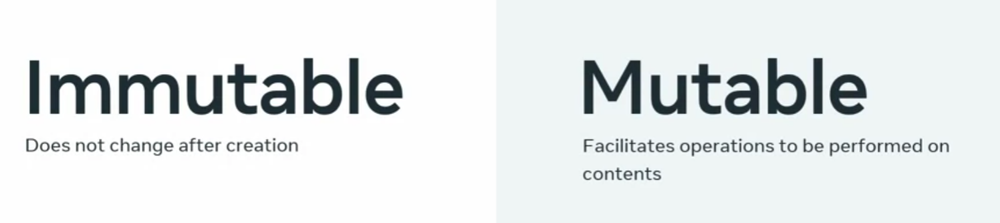

# Meat interview Preparation 

Based on Couses course [Meta Coding Interview Perparation](https://www.coursera.org/learn/coding-interview-preparation)

## Mutable  vs Immutable

## First-class Objects 🥇🏆👨‍💻
First-class objects in a programming language are VIPs. They can:

1. 🧩 Appear in expressions
2. 🏷️ Be assigned to a variable
3. 📥 Be used as an argument in functions
4. 📤 Be returned by a function call

Remember 'EVAC' 🆘 for first-class objects - they are in **E**xpressions, as **V**ariables, **A**rguments, and function **C**alls.

### Functions as First-Class Objects 🔄🎁
In functional programming, functions are also first-class objects, which means you can pass functions as arguments to other functions. For example, in the function `applyTwice(f, x)`, `f` is a function that is applied twice on `x`.

Functions that can take other functions as arguments or return them as results are known as higher-order functions. They're the bosses of the function world! 🏢👨‍💼🎩

