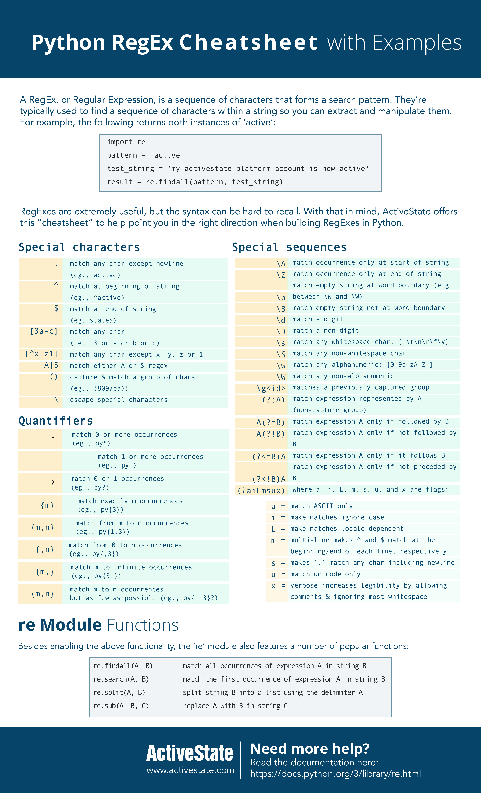
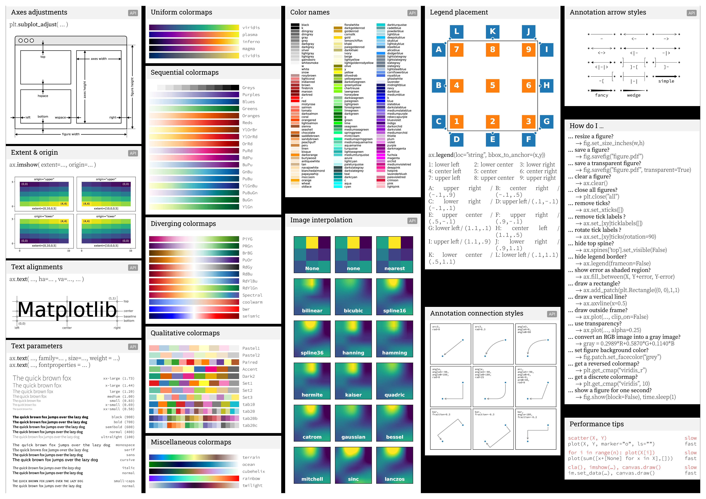
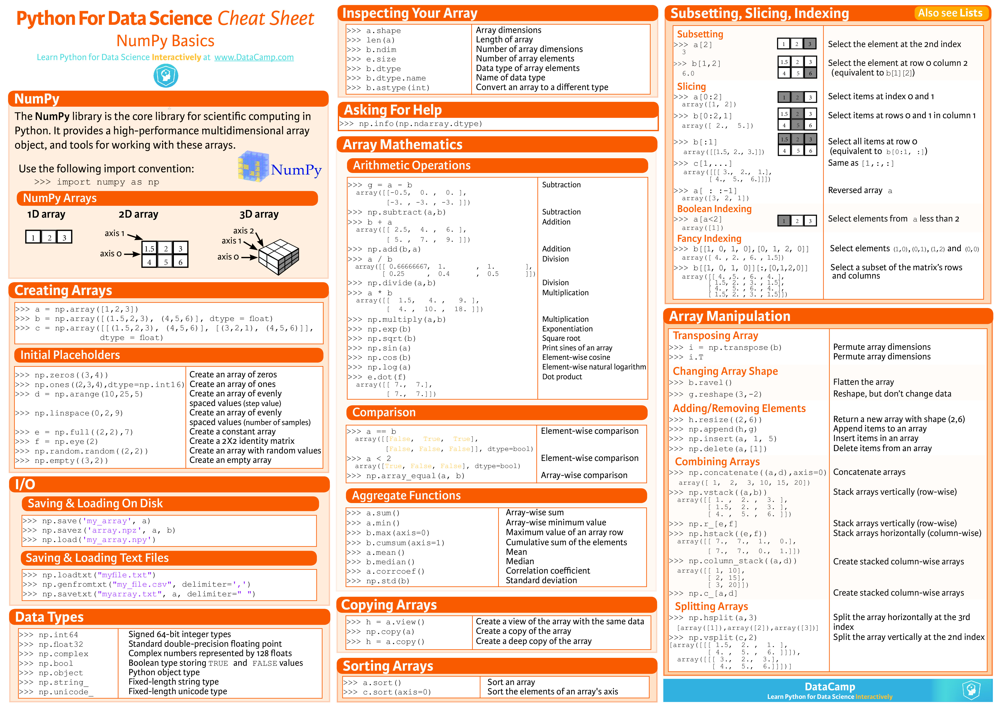
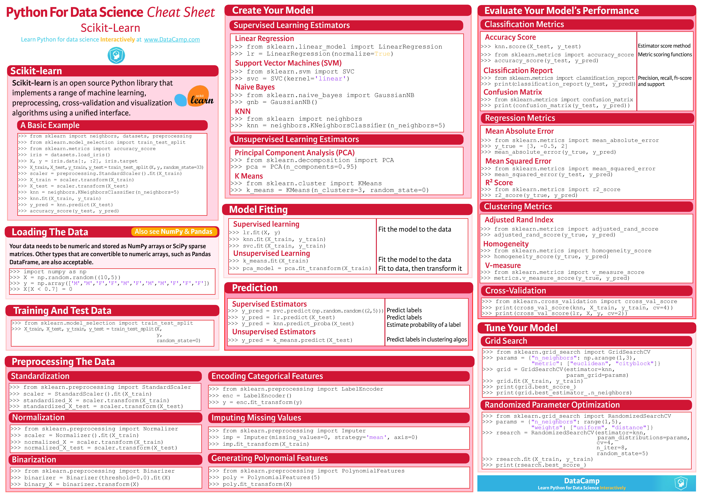

# CheetSheet Collection

- [Python Detecated](.\Python\index.md)

  

## A1Python-RegEx-Cheatsheet.jpg

 

 
## A3VIM.png

 

 
## ABegginers-Python-Cheat-Sheet.png

 

 
## B0P-MatplostLibcheatsheets-0.jpg

 

 
## B1P-MatplostLibcheatsheets-1.jpg

 

 
## D0MarkDown-0.jpg

 

 
## DMarkDown-1.jpg

 

 
## Intermediate-Python-Cheat-Sheet-1.png

 

 
## machine_learning_flashcards.jpg

 

 
## P-Basics.jpg

 

 
## P-Bokeh.jpg

 

 
## P-ImportingData.jpg

 

 
## P-JupyterNotebook.jpg

 

 
## P-Keras.jpg

 

 
## P-Matplotlib.jpg

 

 
## P-Numpy.jpg

 

 
## P-Pandas.jpg

 

 
## P-PySpark.jpg

 

 
## P-SciKit.jpg

 

 
## P-SciPy.jpg

 

 
## P-Seaborn.jpg

 

 
## PSCheetSheet.jpg

 

 
