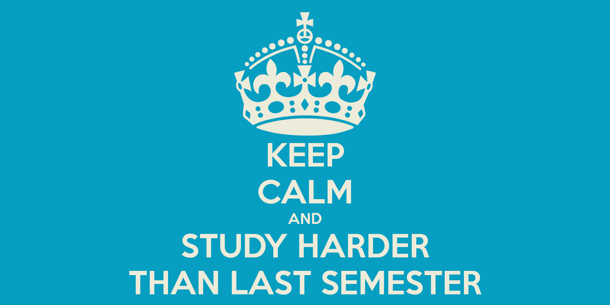

# FAANG Mental 

## Quesitons/Ideas

- [ ] 12 hours work 
- [ ] Tech Lead Tips 

## Be calm

Today on the call with Kyle I notice how calm he is about bad newses and how little they actually effect him. 

I **MUST** build such mentalitie. I believe one of the key concepts might be:

- Box brathing
- Mediation
- **DONT PANIC**
- Running/Workout(back pain)
- Daily rutine.
- Not allowing myself to freak out

There was mutiple times that I could have good life. But I wasn't able to focus on daily tasks. Because was owerwhelmed on daily tasks. Than I had a big technical debt and wasn't able to deliever anthing at all. 

## Study hard 

- 12 hour studying

## Consistancy

## TechLead

- Idea of losing money if u are not working.
- Seat and code uninterapted for long periods of time.

## Problems

- Anexiety Disorder 
- Heshtalts
- DAYDREAMING
- BackPain
- Not able to sit and work.
- Doing everthing else first 
    > I simplie need to start following reliously rule #1 

- Panicing
- Overcoplicating
- ADHD
