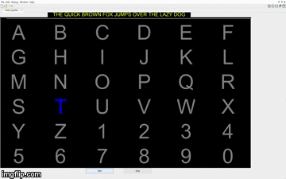

# OpenBCI

## Dictionary

- **BCI** **B**rain **C**omputer **I**interface

## BrainFlow

Project of my Russian friend andrey Parfianow

- [link to BrainFlow](https://brainflow.org/)

## Making game with EEG

- [Link to article](https://openbci.com/community/build-your-own-neurofeedback-game-with-openbci/)

## P300 Reading with EEG

- [GitHub repo](https://github.com/vicyas96/P300-Speller)
- [Article](https://sapienlabs.org/lab-talk/implementations-of-the-p300-bci-speller/)

🔍📚 **P300 Speller Variations:** The P300 speller is a key brain-computer interface application. Its three main variations are: the Row-Column (RC) speller, Checkerboard (CB) speller, and Region-Based speller.

🔍🔻 **Issues with RC Paradigm:** The RC paradigm is the original model but it has several problems. About 35% of characters are misidentified due to issues like adjacency-distraction errors and successive flashing.

🔍🔝 **Checkerboard and Region-Based Paradigms:** The CB and Region-Based spellers offer improvements over the RC paradigm. They address the issues of adjacency-distraction and double-flashing errors, boosting accuracy.

### Glossary

📖 **Brain-Computer Interface (BCI):** A communication system between the brain and an external device.

📖 **P300 event-related potential (ERP):** A brain signal used in BCIs. It's named for its positive polarity and latency (300 ms post-stimulus).

📖 **Row-Column (RC) Paradigm:** The original P300 speller design, where letters and numbers are presented in a 6x6 matrix with random flashing of rows and columns.

📖 **Checkerboard (CB) Paradigm:** An improved P300 speller design. It uses a virtual checkerboard pattern to reduce perceptual errors.

📖 **Region-Based Paradigm:** A P300 speller variation where characters are grouped into regions. It improves accuracy and removes adjacency flash issues.

📖 **Adjacency-Distraction Errors:** These errors happen when characters adjacent to the intended ones are selected.

📖 **Double-Flashing Errors:** These errors occur when a character flashes twice in a row, causing potential misidentification.

### Simplified Content

🧐 The P300 speller is a communication tool used by people with neuromuscular diseases. It has three types: the Row-Column (RC), Checkerboard (CB), and Region-Based spellers.

🧐 The RC speller was the first one. It uses a 6x6 matrix of letters and numbers, with rows and columns flashing randomly. But it has some issues like picking up wrong characters and problems with quick double-flashing of characters.

🧐 The CB and Region-Based spellers were created to address these problems. The CB design arranges characters in a virtual checkerboard to avoid errors, while the Region-Based speller groups characters into seven regions, eliminating adjacent flash issues and improving accuracy.

