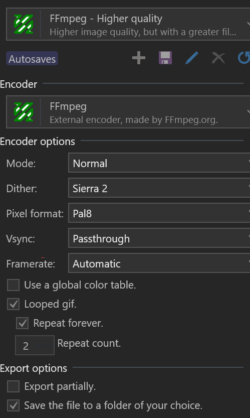
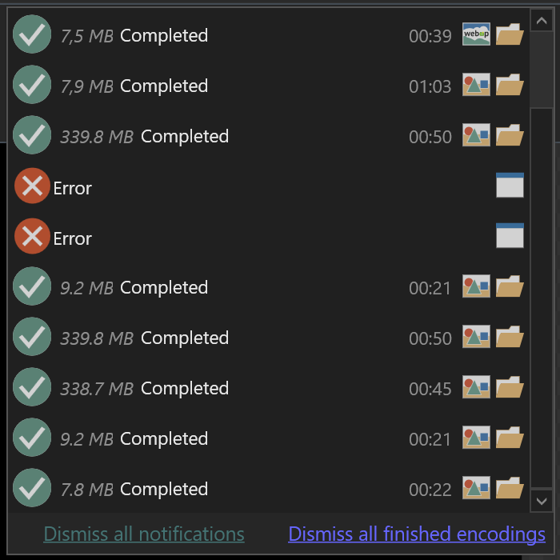

# Media Formats

## ImageMagick

### PDF2JPG

```PowerShell
foreach ($f in $files){
     $name = $f.Name -replace '.pdf'
     $name = $name +".jpg"
     echo $name
     magick convert -density 400 $f.Name -quality 90 $name
 }
```

## ScreenToGif



