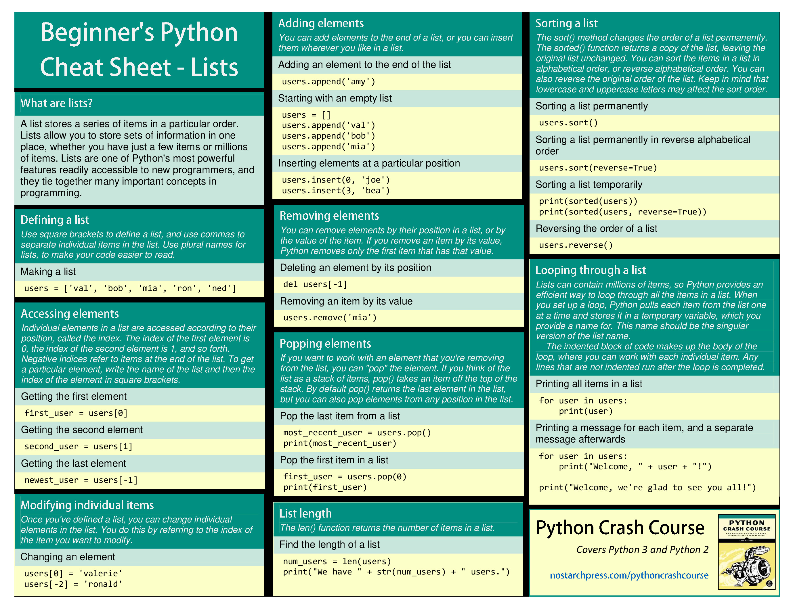
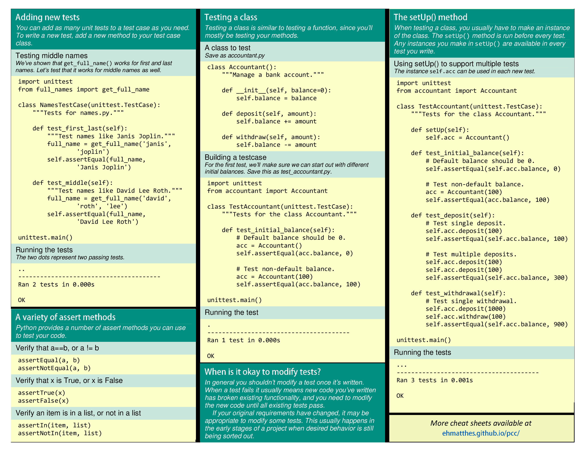
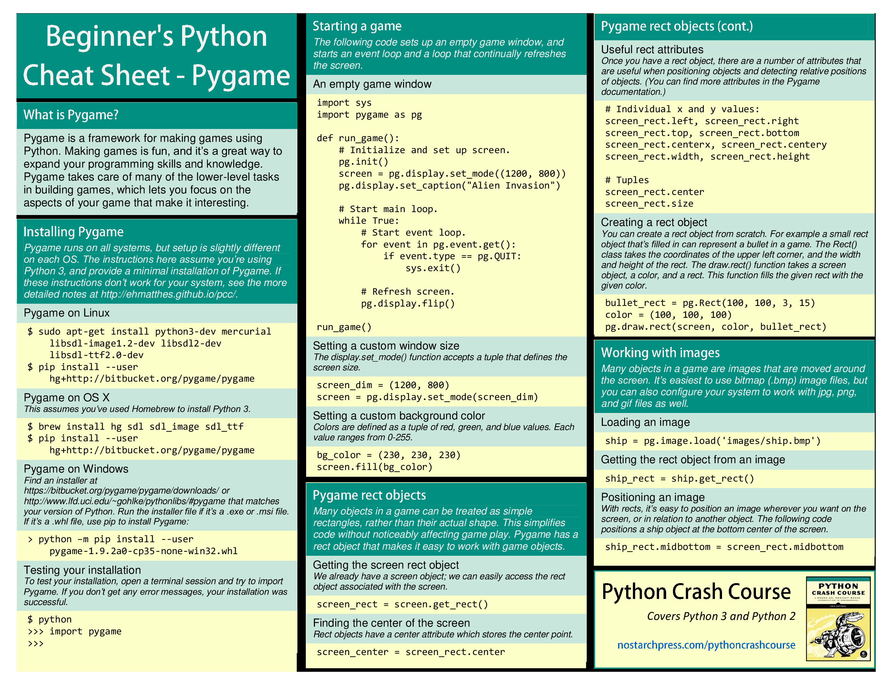

# Cheat Sheet

## Content

- [List](#List)
- [Dict](#Dict)
- [While](#While)
- [Func](#Func)
- [Classes](#Classes)
- [Files](#Files)
- [Testing](#Testing)
- [PyGame](#Pygame)
- [MatPlot](#MatPlog)
- [PyGal](#PyGal)

## List

## Dict

## While

## Func

## Classes

## Files

## Testing

## PyGame

## MatPlot 

## PyGal

## Django

