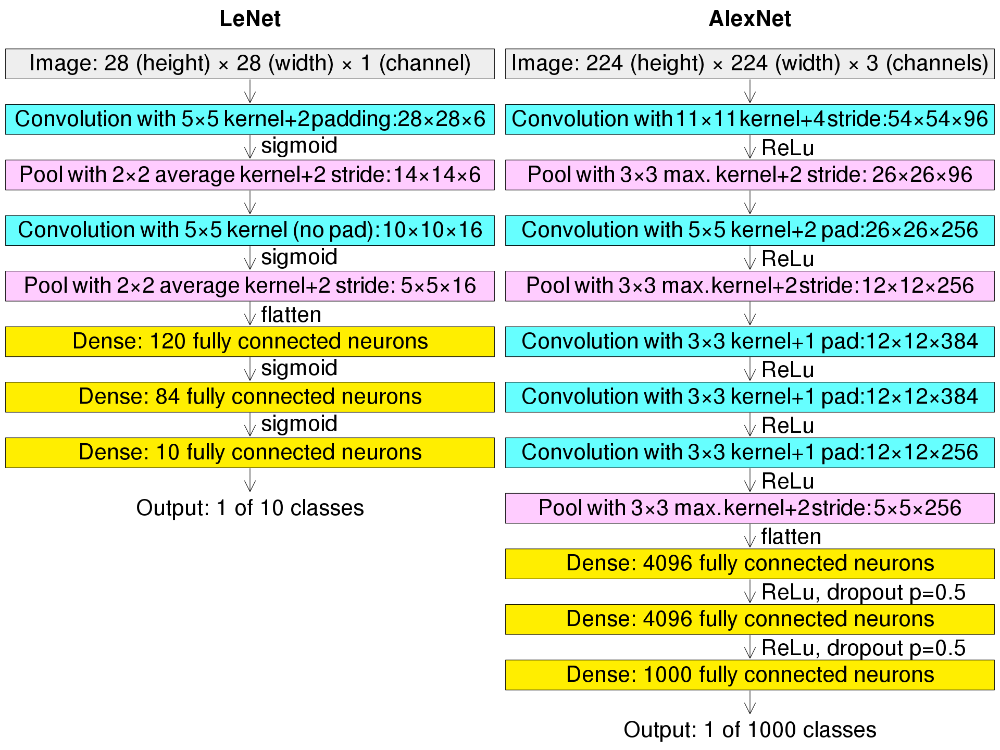
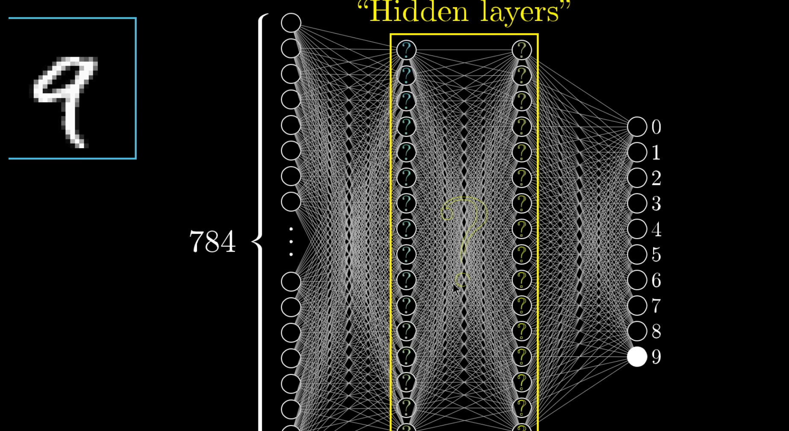
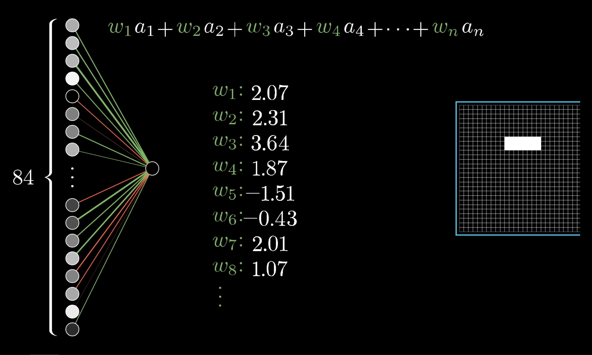
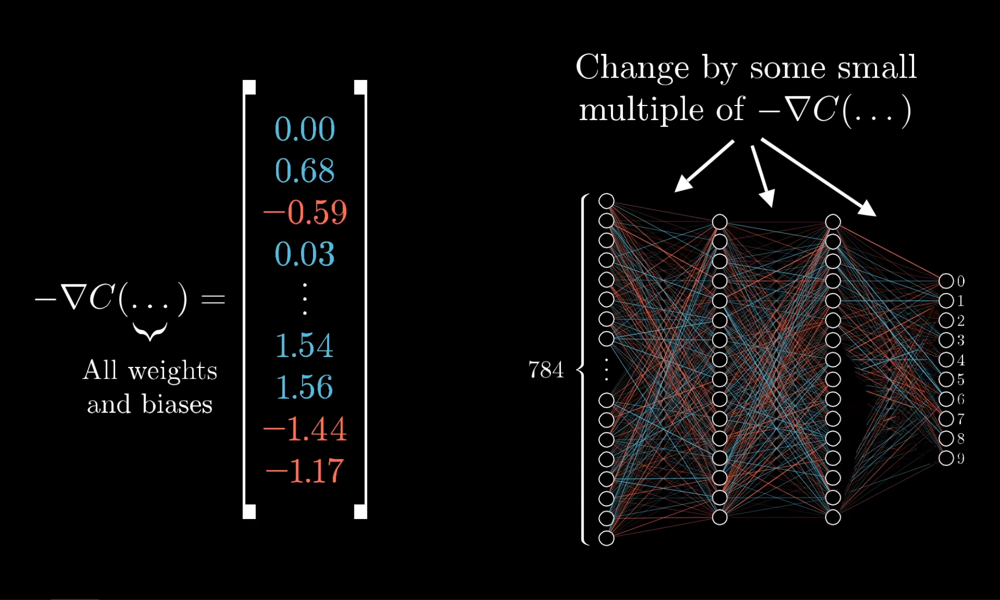

# Machine Learning

## Resoursces
- [Macinea Learning Manga](http://localhost/Books/ML/A0PythonManga.pdf)

## Basics

### MNIST

### Difrent Networks

### Hidden Layer

Some computer part that we now nothihng             

### Weights & Bios

The influnce of the activation layer

**Bios**

### Sigmoid Function

The funciton that is goes close to -1 or 1 
the bigger the number is 

This **math** way  to deteming the weight

Actually Deep network dosen's use **Sigmoid** They use the ReLU

## Math 

We can thinc about the neuro netowrk as simplie like about math

#### Cost Fucntion

Cost fucntion is way to mesure what changes are postive and wha tare negative

### Supervised Machine Learning

Algorithm to data to match classify yet-unseen data.

### Unsupervised Machine Learning

When we look for hidden **structure** in data.

### Feature Engineering

Feature engineering process of creation feature do analyze the data.

### RMSE

`RMSE` - **R**oot of **M**ean **S**quared **E**rror
Evaluation technique by squaring root error.

### Binary classification

Is **supervised machine learning** task. To understand binary nature of the task.

#### Input/Output

`Score` - Single
`PredictionLapel` - bool

### Multiclass classification

A supervised machine learning task is used to predict class category.

### Regression

IS **SML** Just for simple Graphic

 ### Clustering

IS **UML**(Unsupervised Machine Learning) uniting data into clusters by similar characteristics

### Anomaly Detection

>Security

### Ranking

>Rating

### Recommendation

MatrixFactorization.
