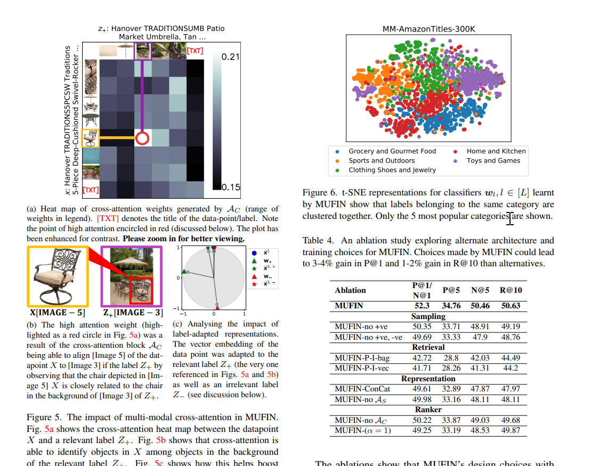
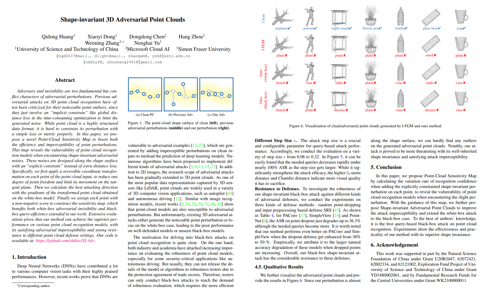
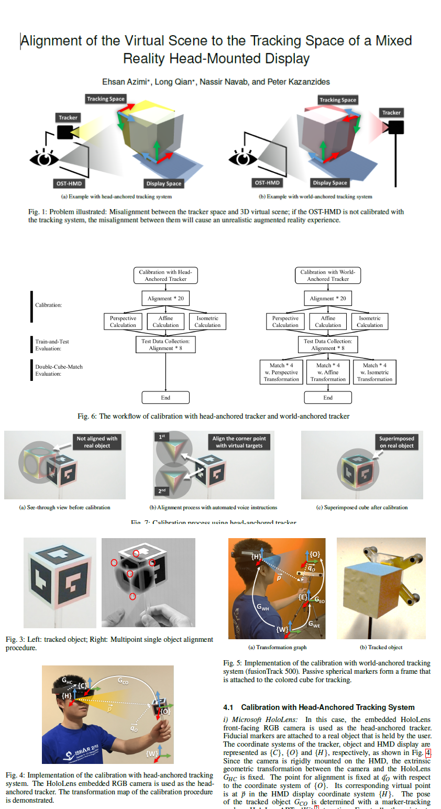
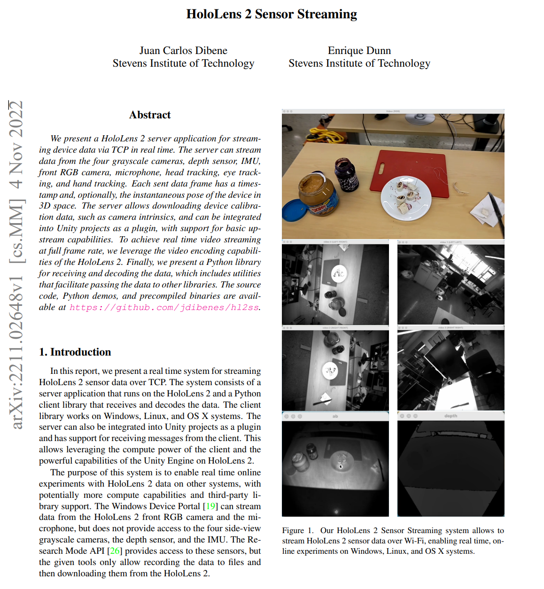
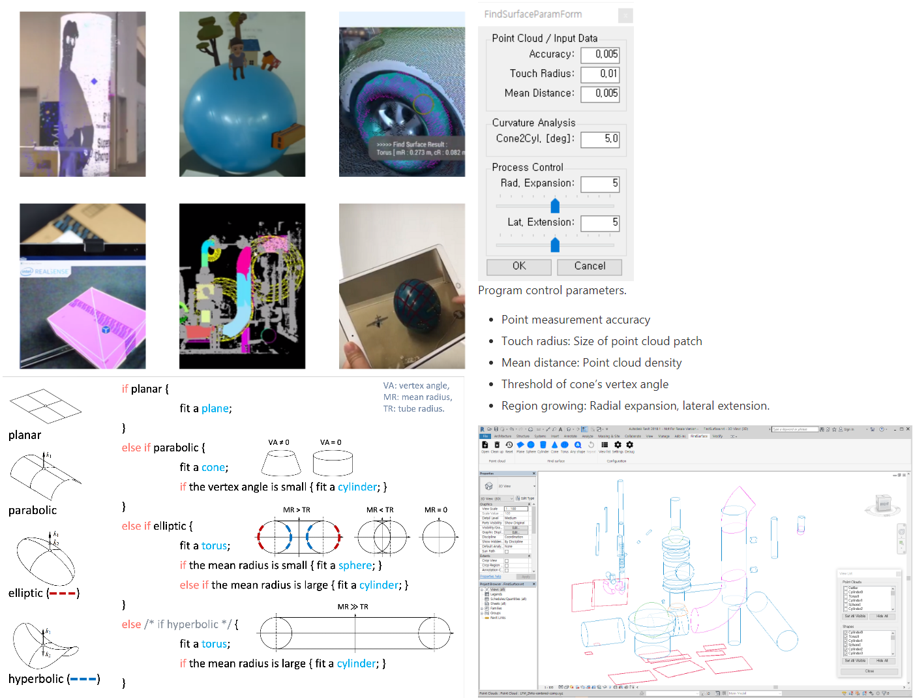

# Microsoft Research

- [HoloLens Better algignment Article](https://manoramajha.medium.com/alignment-in-mr-475444cba3ec)

- [Shareed autonomy with MiwxedReality Zurich](https://www.microsoft.com/en-us/research/video/mixed-reality-for-shared-autonomy/)

## Multi Model Extreme-Classification

- [Research Web Page](https://www.microsoft.com/en-us/research/publication/multi-modal-extreme-classification/)

- [Multi-model Extreme Classification pdf](./pdf/mittal22.pdf)

## Shape invariant

- [Shape Invariant](./pdf/2203.04041.pdf)

- [Pixel Perfect structure from Motion](./res/2108.08291.pdf)

- [Cross platform localization and mapping](https://arxiv.org/pdf/2012.01377.pdf)

## Cube Alignment

- [Reserch Paper PDF](./res/1703.05834.pdf)

## Sensor Streaming

- [Reserch Paper PDF](./res/2211.02648v1.pdf)

## Hololens Vuforia Neuronavigation

- [Reserch Paper PDF](./res/Augmenting_Microsofts_HoloLens_with_Vuforia_Track.pdf)

## Existing Solutions

### Curve Serface

They have nice SDK for shape Detection.

- [Web page](https://developers.curvsurf.com/)
- [Github HoloLens Demo](https://github.com/CurvSurf/FindSurface-HoloLensDemo-UWP)
