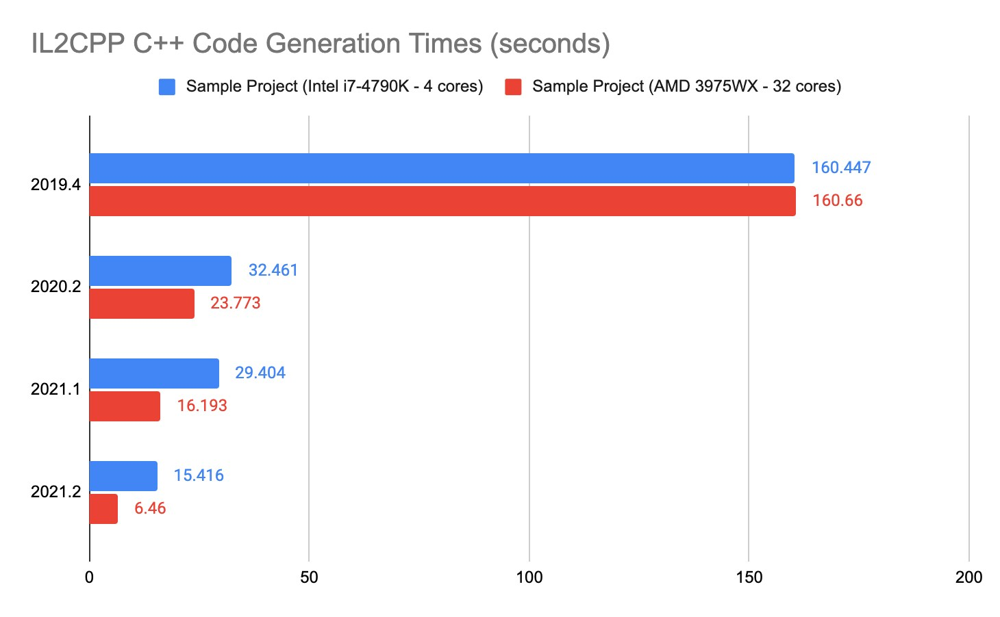
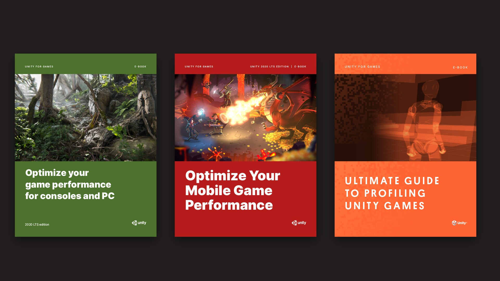
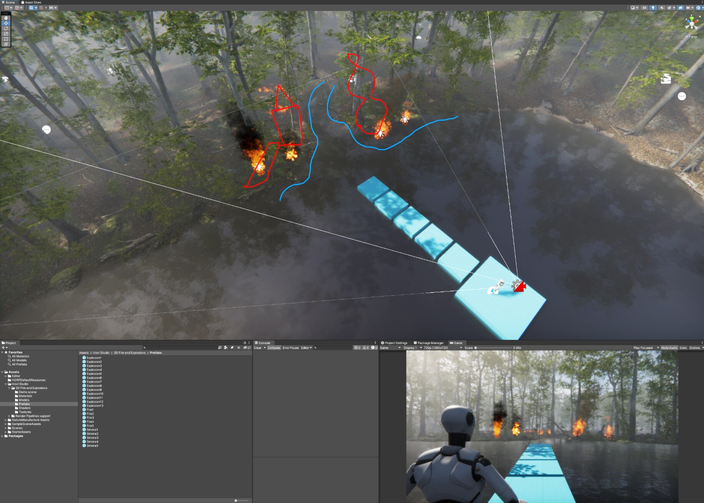
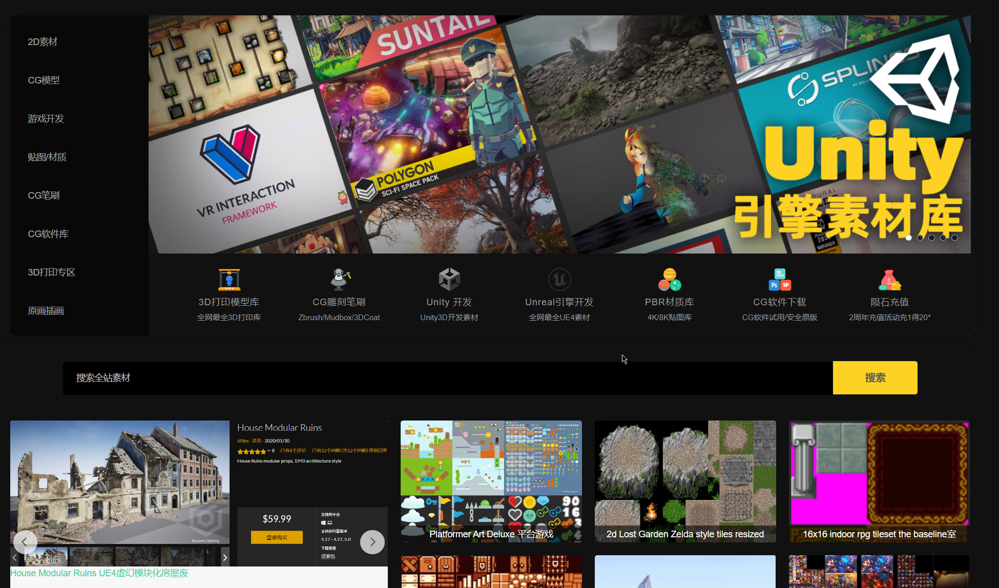
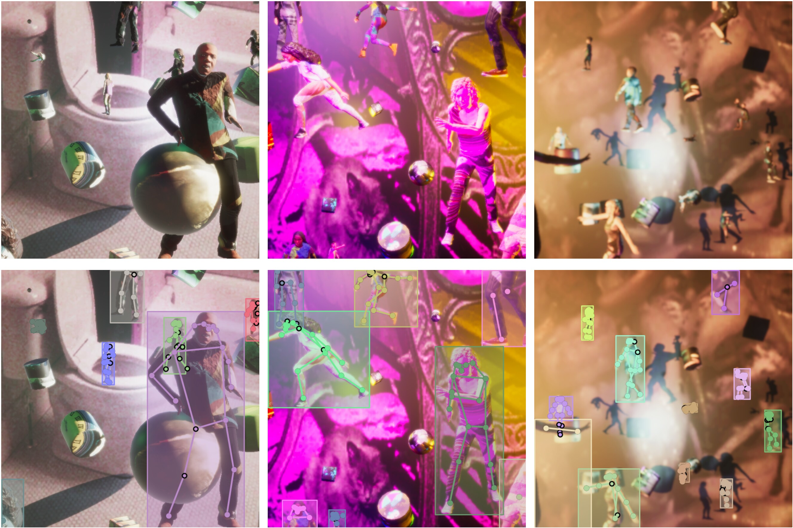
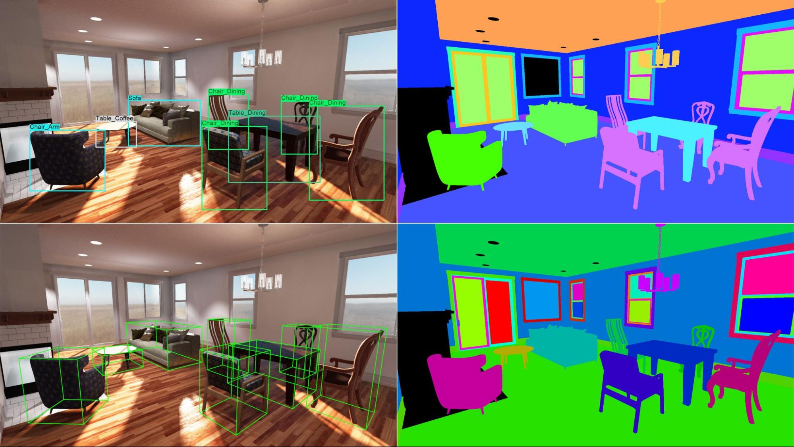
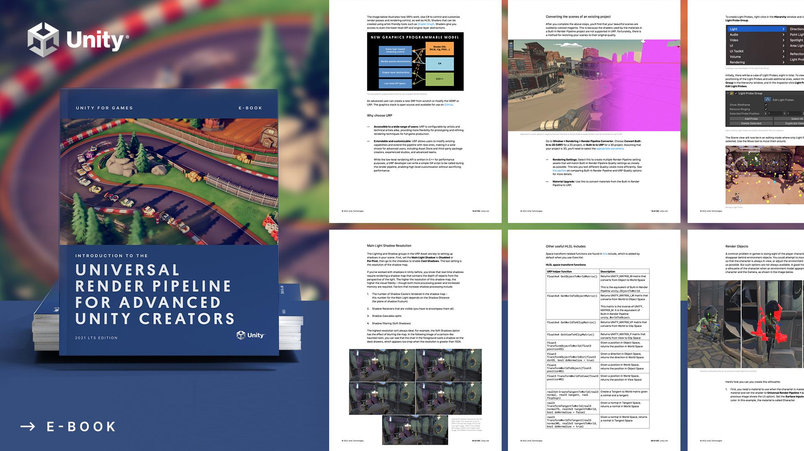
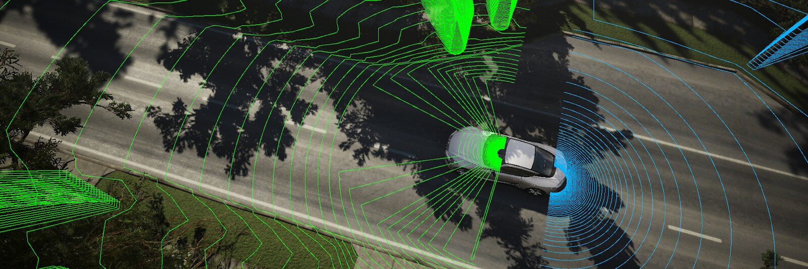
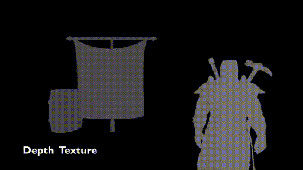

# Articles

## Unity Blog

- [ Speeding up Unity workflow](https://blog.unity.com/technology/behind-the-scenes-speeding-up-unity-workflows)

- [Optimization books](https://blog.unity.com/technology/games-focus-profiling-and-performance-optimization)

- [Creating realist Matrial using Sterio via CromeBalls](https://blog.unity.com/technology/create-realistic-materials-using-photometric-stereo-via-chrome-ball-in-artengine)

- [System for Emergent game design](https://blog.unity.com/technology/systems-that-create-ecosystems-emergent-game-design)

- [Unity Chinis Assets](https://www.cgxq.net/)

- [Syntatic humans data for AI](https://blog.unity.com/technology/human-centric-computer-vision-with-unity-synthetic-data)

- [GameDesignPlaybook](http://localhost/Books/unity-game-designer-playbook.pdf)

- [Unlocking Intelligent solutions in the home with computer  vision](https://blog.unity.com/technology/unlocking-intelligent-solutions-in-the-home-with-computer-vision)

- [Migration to URP](https://blog.unity.com/technology/migrating-built-in-shaders-to-the-universal-render-pipeline)

- [Clean Code C#](https://blog.unity.com/technology/clean-up-your-code-how-to-create-your-own-c-code-style) 

- [Automus Simulation in Unity](https://blog.unity.com/manufacturing/jump-start-your-autonomous-simulation-development-with-unitys-simviz-solution)

## Graphics

0. [Unity new official graphical features](https://portal.productboard.com/unity/1-unity-platform-rendering-visual-effects/tabs/3-universal-pipeline)

1. [Cyanilum GIANT URP ShaderGraph Randering and visualizaiton collection](https://www.cyanilux.com/resources/)
> Even make copy locally `CyaniluxResources.md`

2. [Unity blog introduction to URP + numbers on optimization](https://blog.unity.com/technology/how-the-lightweight-render-pipeline-is-evolving)

#### Unity Toon Shader

- [GitHub project](https://github.com/unity3d-jp/UnityChanToonShaderVer2_Project)

### URP Edge Detection

1. [Article Solution](https://alexanderameye.github.io/notes/edge-detection-outlines/)
2. [More advenced article on URP Outline](https://kyriota.com/2022/08/02/Unity_Pixelated_Art_Style_In_URP/)
3. [Tree.js solution with intresting live demo](https://omar-shehata.medium.com/how-to-render-outlines-in-webgl-8253c14724f9)
4. [Article with GBuffer in URP](https://kyriota.com/2022/08/02/Unity_Pixelated_Art_Style_In_URP/)
5. [ Depth and Z Test on URP](https://www.cyanilux.com/tutorials/depth/)
6. [ Main article pormises working solution but dosen't work](https://alexanderameye.github.io/notes/edge-detection-outlines/)

### Shader graph

[ Unity Blog Normal mapping on Shader Graph](https://blog.unity.com/technology/normal-map-compositing-using-the-surface-gradient-framework-in-shader-graph)

### AR/VR/XR

- [Unity Blog Maximize Preformance with Stereio Rendering](https://blog.unity.com/technology/how-to-maximize-ar-and-vr-performance-with-advanced-stereo-rendering)

### ML/CV

- [Syntetic Huamans Unity Computer Vision part of Perception package](https://github.com/Unity-Technologies/com.unity.cv.synthetichumans/wiki/Synthetic-Humans-Tutorial)

- [Unity Text to Speech](https://github.com/voxell-tech/UnityTTS)
