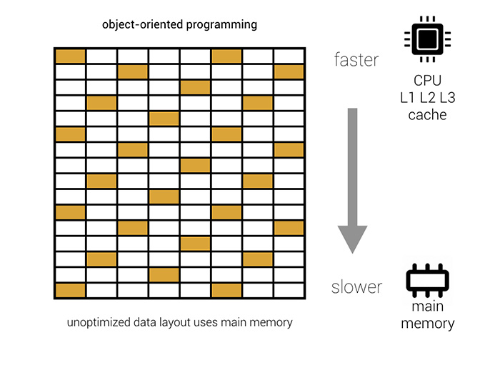
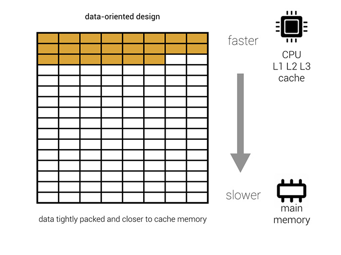

# DOTS

**DOTS**(**D**ata,**O**riented,**T**echonology,**S*tack)

## Outline

1. [Links](#links-questions)
2. [ECS](#ecs)

## Links Questions

[Unity Academy](http://aras-p.info/texts/files/2018Academy%20-%20ECS-DoD.pdf)
[Intro ECS](D:\Lib\Videos\Unity)
[Intel Dots Tutorial](https://software.intel.com/content/www/us/en/develop/articles/get-started-with-the-unity-entity-component-system-ecs-c-sharp-job-system-and-burst-compiler.html)

### WebGL

```c#
using UnityEditor;
using UnityEngine;

[InitializeOnLoad]
class EnableThreads
{
    static EnableThreads()
    {
        PlayerSettings.WebGL.linkerTarget = WebGLLinkerTarget.Wasm;
        PlayerSettings.WebGL.threadsSupport = true;
        PlayerSettings.WebGL.memorySize = 512;
    }
}

```

### Questions

1. Async Await in DOTS

### Unity2020.1.6

- [Entities 0.16](https://docs.unity3d.com/Packages/com.unity.entities@0.16/manual/index.html)
- [Hybrid Renderer 0.10](https://docs.unity3d.com/Packages/com.unity.rendering.hybrid@0.10/manual/index.html)
- [Unity Physics 0.5.1](https://docs.unity3d.com/Packages/com.unity.physics@0.5/manual/index.html)
- [Hovak Physics 0.4.1](https://docs.unity3d.com/Packages/com.havok.physics@0.4/manual/index.html)

- [Jobs 0.17](https://docs.unity3d.com/Packages/com.unity.jobs@0.7/manual/index.html)
- [Burst 1.6](https://docs.unity3d.com/Packages/com.unity.burst@1.6/manual/docs/QuickStart.html)

### manifest.json
```json
{
    "com.havok.physics": "0.4.1-preview.2",
    "com.unity.animation": "0.8.0-preview.4",
    "com.unity.burst": "1.6.0-pre.2",
    "com.unity.entities": "0.16.0-preview.21",
    "com.unity.jobs": "0.7.0-preview.17",
    "com.unity.render-pipelines.universal": "8.2.0",
    "com.unity.rendering.hybrid": "0.10.0-preview.21",
    "com.unity.scriptablebuildpipeline": "1.17.0",
    "com.unity.test-framework": "1.1.24"
  },
  "enableLockFile": true,
  "testables": [
    "com.unity.collections",
    "com.unity.animation",
    "com.unity.entities",
    "com.unity.jobs",
    "com.unity.rendering.hybrid"
  ]
}
```


## ECS

**ECS**(**E**ntitiy,**C**omponents,**S**ystems):




- Entity - Data
- Components - nothing
- System - is where is logic.


## Job System

Not ECS can be use **separetely**.

### Safety System

**Race Condition** - When one part of code depends on another.


**Safety System** - Prevent that by sanding data to potential race conditions only **blittable data types**

**Interoperability** - sharing data with blittable types unmanaged and managed .Net code.

**Managed code** - that executes only under **CLI** (Virtual machine)

### Native Container

Sort of shared memory to be able to accress location not a copy

**KeyPoints:**

- DifferentType
- ReadOnly                   - to avoid DisposalSentinel
- Container Allocator   - for best performance

#### Types:
```c#
//In Job System
class  NativeArray {}
class  NativeSlice {}//Get slice of NativeArray

//Extended in Unity ECS
class  NativeList {}
class  NativeHashMap {}
class  NativeMultiHashMap {} //multi values per key
class  NativeQueue {}
 
 [ReadOnly]
public NativeArray<int> input; // If my task need read only to avoid DisposalSentinel


NativeArray<float> result = new NativeArray<float>(1, Allocator.TempJob);

Allocator.Temp 
    // FAST  one Frame 
    // Not for passing to NativeContainer
    // Call Dispose before going to MonoBehaviour.Update

Allocator.TempJob 
    // 4 frames don't Depose 

Allocator.Presistent 
    // Slow but long living 
```

### Jobs

[IJob](interface)

- [Execute()](Method)

```c#
public struct MyJob : IJob
{
    public int a;
    public NativeArray<int> result;

    public void Execute()
    {
        result[a] = a++;
    }
}

```

### Jab Schedule

```c#
NativeArray<float> result = new NativeArray<float>(1, Allocator.TempJob);
MyJob jobData = new MyJob();
jobData.result = result;

static class IJobExtensions{ 
    static void Schedule();}
// Schedule the job
JobHandle handle = jobData.Schedule();  

// Wait for the job to complete
handle.Complete();
float aPlusB = result[0];
result.Dispose();
```

### JobHandle

```c#
JobHandle firstJobHandle = firstJob.Schedule();
JobHandle secondJobHandle = secondJob.Schedule(firstJobHandle);
secondJobHandle.Complete()

// Combine multiple job Handle
int numJobs = 10;
NativeArray<JobHandle> handles = new NativeArray<JobHandle>(numJobs, Allocator.TempJob);
JobHandle jh = JobHandle.CombineDependencies(handles);

// Doing a lot of jobs at once
public static void ScheduleBatchedJobs(); 
```

### IJobParallelFor

You need to set the size of array and it's endex before running;

```c#
struct IncrementByDeltaTimeJob: IJobParallelFor
{
    public NativeArray<float> values;
    public float deltaTime;

    public void Execute (int index)
    {
        float temp = values[index];
        temp += deltaTime;
        values[index] = temp;
    }
}
IJobParallelFor jobData = new IncrementByDeltaTimeJob();
jobData.value = value;
jobData.deltaTime = Time.deltaTime;

//Make sense execute multiple jobs per batch from 1 to 64
JobHandle handle = jobData.Schedule(result.Length, 32);

```

**Example**

```c#
using UnityEngine;
using Unity.Collections;
using Unity.Jobs;

class ApplyVelocityParallelForSample : MonoBehaviour
{
    struct VelocityJob : IJobParallelFor
    {
        // Jobs declare all data that will be accessed in the job
        // By declaring it as read only, multiple jobs are allowed to access the data in parallel
        [ReadOnly]
        public NativeArray<Vector3> velocity;

        public NativeArray<Vector3> position;

        public float deltaTime;

        public void Execute(int i)
        {
            // Move the positions based on delta time and velocity
            position[i] = position[i] + velocity[i] * deltaTime;
        }
    }

    public void Update()
    {
        var position = new NativeArray<Vector3>(500, Allocator.Persistent);

        var velocity = new NativeArray<Vector3>(500, Allocator.Persistent);
        for (var i = 0; i < velocity.Length; i++)
            velocity[i] = new Vector3(0, 10, 0);

        var job = new VelocityJob()
        {
            deltaTime = Time.deltaTime,
            position = position,
            velocity = velocity
        };

        // When there is very little work values of 32 or 64 can make sense.
        JobHandle jobHandle = job.Schedule(position.Length, 64);

        // Ensure the job has completed.
        jobHandle.Complete();

        Debug.Log(job.position[0]);

        // Native arrays must be disposed manually.
        position.Dispose();
        velocity.Dispose();
    }
}
```