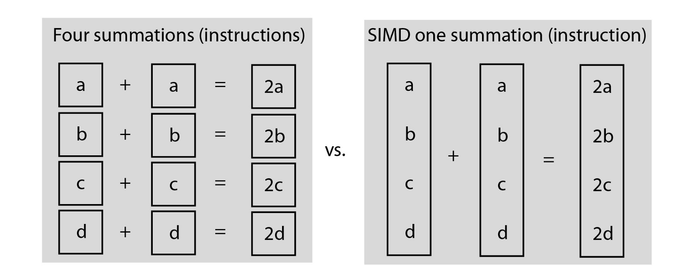

# DOTS

**DOTS**(**D**ata,**O**riented,**T**echonology,**S**tack)

## Questions

1. Async Await with ECS?

## Links

- [Intel Dots Tutorial](https://software.intel.com/content/www/us/en/develop/articles/get-started-with-the-unity-entity-component-system-ecs-c-sharp-job-system-and-burst-compiler.html)

- [DOTS water Brust](https://www.raywenderlich.com/7880445-unity-job-system-and-burst-compiler-getting-started)

- [ECS non Unity](http://aras-p.info/texts/files/2018Academy%20-%20ECS-DoD.pdf)

## ECS

**ECS**(**E**ntitiy,**C**omponents,**S**ystems):

- [Entity](#entities) - Identity
- [Component](#component) - Data
- [System](#system) - Behaviour


### Entities

Entities - is like lightweight `GameObject`.

`EntityManger` - is one **ring** to control them all.
`EntityArchetype` - it does not have a name only type.

#### Basic Example


#### Create

You can convert prefabs into entities or made your own spawner.

`EntityManager.CreateEntity` - the way evil is born by giving:

- `ComponentType[]` - array of components
- `EntityArchetype` - Instruction.
- `Instantiate` - Clone of existing.
- Create empty and then add components.
**Multiple by**
Fill ``NativeArray`` by ``CreateEntity`` or ``Instantiate`` - cloning.

### Components

Our data and it comes in many forms:

- `IComponentData` - general.
- `IBufferElementData` - buffer
- `ISharedComponentData` - shared.
- `ISystemStateComponentData` - state (created or destroyed)
- `ISharedSystemStateComponentData` - System sate
- `Blob assets` - non component just for storing data has reference.
 Data will be  available to `Jobs`.


### System


#### Instantiating

ECS automatically does that.
By default ads to **Simulation** group.

#### Types

- `SystemBase` - is `MonoBehaviour` from ECS

- `EntityCommandBufferSystem` - buffer for other systems.
- `ComponentSystemGroup` - nested and other organization.
- `GameObjectConversationSystem` - run in Editor.

#### Example
 
Just <kbd>Ctrl</kbd>+ <kbd>X</kbd>

```CSharp
public struct Position : IComponentData
{
   public float3 Value;
}

public struct Velocity : IComponentData
{
   public float3 Value;
}

public class ECSSystem : SystemBase
{
   protected override void OnUpdate()
   {
       // Local variable captured in ForEach
       float dT = Time.DeltaTime;

       Entities
           .WithName("Update_Displacement")
           .ForEach(
               (ref Position position, in Velocity velocity) =>
               {
                   position = new Position()
                   {
                       Value = position.Value + velocity.Value * dT
                   };
               }
           )
           .ScheduleParallel();
   }
}

```

### System lifecycle Callbacks

> Exaclty like in `MonoBehaviour` but in `SystemBase`

- `OnCreate()` - first.
- `OnStartRunning()` - before first `OnUpdate()` when is **resumed**
- `OnUpdate()` - each frame when there is work and isEnable
- `OnStopRunning()` -  no entities matching also before on Destroy .
- `OnDestroy()`  - last.

### SystemUpdateOrder

Is determent by by `ComponentSystemGroup` attributes:

-`UpdateInGroupAttribute`
-`UpdateBeforeAttribute`
-`UpdateAfterAttribute`

If group not specified it will go to the World default group.


### ECS Concepts

### Archetypes

`EntityArchetype`  - is combination of entities if we remove `Renderer`.
Then archetype will be **dynamically** changed.


### Memory Chunks

`ArchetypeChunk` - allocated memory by chunk.
When **dynamic** changed entity archetype it will be move to new chunk.


### Entity Queries

`EntityQuery` - Archetype request for search by components can be:

- All -     `==` match **all** components
- Any -     `||`at least **one** component
- None -    `!=`  **none** of componts shold match

### Jobs

`Entities.ForEach`
`IJObEntityBatch`
`Schedule()`

## Job System

Not ECS can be use **separetely**.

### Safety System

**Race Condition** - When one part of code depends on another.

**Safety System** - Prevent that by sanding data to potential race conditions only **blittable data types**

**Interoperability** - sharing data with blittable types unmanaged and managed .Net code.

**Managed code** - that executes only under **CLI** (Virtual machine)

### Native Container

Sort of shared memory to be able to accress location not a copy

**KeyPoints:**

- DifferentType
- ReadOnly                   - to avoid DisposalSentinel
- Container Allocator   - for best performance
#### Types:
```c#
//In Job System
class  NativeArray {}
class  NativeSlice {}//Get slice of NativeArray

//Extended in Unity ECS
class  NativeList {}
class  NativeHashMap {}
class  NativeMultiHashMap {} //multi values per key
class  NativeQueue {}
 
 [ReadOnly]
public NativeArray<int> input; // If my task need read only to avoid DisposalSentinel


NativeArray<float> result = new NativeArray<float>(1, Allocator.TempJob);

Allocator.Temp 
    // FAST  one Frame 
    // Not for passing to NativeContainer
    // Call Dispose before going to MonoBehaviour.Update

Allocator.TempJob 
    // 4 frames don't Depose 

Allocator.Presistent 
    // Slow but long living 
```

### Jobs

[IJob](interface)

- [Execute()](Method)

```c#
public struct MyJob : IJob
{
    public int a;
    public NativeArray<int> result;

    public void Execute()
    {
        result[a] = a++;
    }
}

```

### Jab Schedule

```c#
NativeArray<float> result = new NativeArray<float>(1, Allocator.TempJob);
MyJob jobData = new MyJob();
jobData.result = result;

static class IJobExtensions{ 
    static void Schedule();}
// Schedule the job
JobHandle handle = jobData.Schedule();  

// Wait for the job to complete
handle.Complete();
float aPlusB = result[0];
result.Dispose();
```

### JobHandle

```c#
JobHandle firstJobHandle = firstJob.Schedule();
JobHandle secondJobHandle = secondJob.Schedule(firstJobHandle);
secondJobHandle.Complete()

// Combine multiple job Handle
int numJobs = 10;
NativeArray<JobHandle> handles = new NativeArray<JobHandle>(numJobs, Allocator.TempJob);
JobHandle jh = JobHandle.CombineDependencies(handles);

// Doing a lot of jobs at once
public static void ScheduleBatchedJobs(); 

```

### IJobParallelFor

You need to set the size of array and it's endex before running;

```c#

struct IncrementByDeltaTimeJob: IJobParallelFor
{
    public NativeArray<float> values;
    public float deltaTime;

    public void Execute (int index)
    {
        float temp = values[index];
        temp += deltaTime;
        values[index] = temp;
    }
}
IJobParallelFor jobData = new IncrementByDeltaTimeJob();
jobData.value = value;
jobData.deltaTime = Time.deltaTime;

//Make sense execute multiple jobs per batch from 1 to 64
JobHandle handle = jobData.Schedule(./result.Length, 32);

```

**Example**

```c#

using UnityEngine;
using Unity.Collections;
using Unity.Jobs;

class ApplyVelocityParallelForSample : MonoBehaviour
{
    struct VelocityJob : IJobParallelFor
    {
        // Jobs declare all data that will be accessed in the job
        // By declaring it as read only, multiple jobs are allowed to access the data in parallel
        [ReadOnly]
        public NativeArray<Vector3> velocity;

        public NativeArray<Vector3> position;

        public float deltaTime;

        public void Execute(int i)
        {
            // Move the positions based on delta time and velocity
            position[i] = position[i] + velocity[i] * deltaTime;
        }
    }

    public void Update()
    {
        var position = new NativeArray<Vector3>(500, Allocator.Persistent);

        var velocity = new NativeArray<Vector3>(500, Allocator.Persistent);
        for (var i = 0; i < velocity.Length; i++)
            velocity[i] = new Vector3(0, 10, 0);

        var job = new VelocityJob()
        {
            deltaTime = Time.deltaTime,
            position = position,
            velocity = velocity
        };

        // When there is very little work values of 32 or 64 can make sense.
        JobHandle jobHandle = job.Schedule(position.Length, 64);

        // Ensure the job has completed.
        jobHandle.Complete();

        Debug.Log(job.position[0]);

        // Native arrays must be disposed manually.
        position.Dispose();
        velocity.Dispose();
    }
}

```

### ITransformParallel


### ECS has ScheduleBatchedJobs implemented

### Tips and Tricks

0. Don't be stupid
1. Do not access static data from job (don't be stupid)
2. Flush scheduled batches (don't be stupid)
3. Don't try to update data from NativeContainer
``` c# 
 nativeArray[0]++; 
 //The same as
var temp = nativeArray[0]; temp++; 
```
4. Call JobHandle.Complete to regain ownership.
5. Don't call Complete right after Schaduale(don't be stupid)
6. Use [ReadOnly] (don't be stupid)
7. Do not allocate managed memory in jobs (don't be stupid)

## Burst

Should be magical just add:
`[BurstCompile]` to the Job struct and magic.


### Burst Menu


### Burst Inspector


### Not done research on Burst

>Not over yet...

## Algos




## CookBook

### WebGL

```c#
using UnityEditor;
using UnityEngine;

[InitializeOnLoad]
class EnableThreads
{
    static EnableThreads()
    {
        PlayerSettings.WebGL.linkerTarget = WebGLLinkerTarget.Wasm;
        PlayerSettings.WebGL.threadsSupport = true;
        PlayerSettings.WebGL.memorySize = 512;
    }
}

```

### !Important

`ComponentSystem` and `JobComponentSystem` - old.
`SystemBase` and `Entities.ForEach` - new   .

## Packages

### manifest.json


#### 2021

```json
    "com.unity.entities": "0.17.0-preview.42",

    "com.unity.rendering.hybrid": "0.11.0-preview.44",
    "com.unity.dots.editor":"0.12.0-preview.6",

    "com.unity.burst": "1.6.0-pre.4",
    "com.unity.jobs": "0.8.0-preview.23",

```

#### 2020
```json
{
    "com.havok.physics": "0.4.1-preview.2",
    "com.unity.animation": "0.8.0-preview.4",
    "com.unity.burst": "1.6.0-pre.2",
    "com.unity.entities": "0.16.0-preview.21",
    "com.unity.jobs": "0.7.0-preview.17",
    "com.unity.serialization": "1.7.0-preview.1",

    "com.unity.render-pipelines.universal": "8.2.0",
    "com.unity.rendering.hybrid": "0.10.0-preview.21",
    "com.unity.scriptablebuildpipeline": "1.17.0",
    "com.unity.test-framework": "1.1.24",


    "com.unity.platforms.windows" : "0.10.0-preview.10",
    "com.unity.platforms.android" : "0.10.0-preview.10",
    "com.unity.platforms.web" : "0.10.0-preview.10"
  },
  "enableLockFile": true,
  "testables": [
    "com.unity.collections",
    "com.unity.animation",
    "com.unity.entities",
    "com.unity.jobs",

    "com.unity.rendering.hybrid",
    "com.unity.dots.editor",


    "com.unity.platforms.windows",
    "com.unity.platforms.android",
    "com.unity.platforms.web"


  ]
}
```

### List

This list is specifically for my `Unity 2020.1.6f`

- [ECS](https://docs.unity3d.com/Packages/com.unity.entities@0.16/manual/index.html)
- [DOTS Editor](https://docs.unity3d.com/Packages/com.unity.dots.editor@0.11/manual/index.html)
- [Hybrid Renderer](https://docs.unity3d.com/Packages/com.unity.rendering.hybrid@0.10/manual/index.html)
- [Burst tutorial](https://docs.unity3d.com/Packages/com.unity.burst@1.3/manual/index.html)
- [Serialization](https://docs.unity3d.com/Packages/com.unity.serialization@1.7/manual/index.html)
