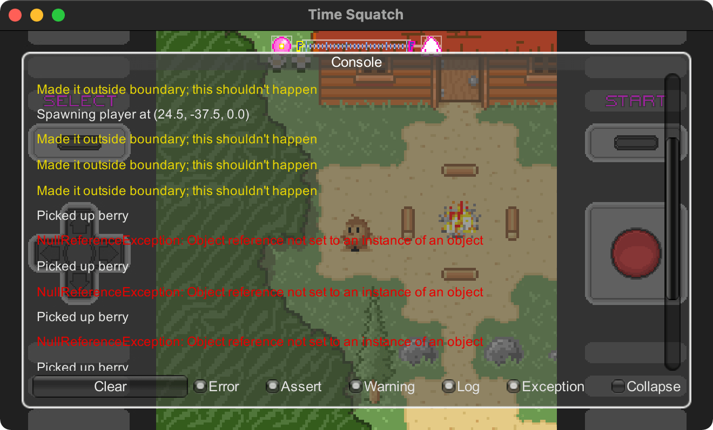

# Unity packages

## Testing

### Unity3d-NSubstitute

[gihut Unity3D-NSubustitue](https://github.com/Thundernerd/Unity3D-NSubstitute)

```pwsh
openupm add net.tnrd.nsubstitute
```
## 2D Animation

2D animation using sprites

- [Sprite Swap](https://docs.unity3d.com/Packages/com.unity.2d.animation@6.0/manual/SLAsset.html)

## Pixel Perfect


- [documentation link](https://docs.unity3d.com/Packages/com.unity.2d.pixel-perfect@5.0/manual/index.html)


## Recorder

- [Documentation](https://docs.unity3d.com/Packages/com.unity.recorder@3.0/manual/index.html)

>manifest.json

```json
	"com.unity.recorder": "3.0.3",
```
There was unconviniance Unity recomends by default version 2. 
But easy enough version **3** and **4** are available in official documentation
Out of pure logic a decided to user verions **3** due to recomendation and it's not per-alpha state

### Questions

- A How to make the **JPEG**?
- B What I have in the examples?
- B `ffmpeg` relation ?
- B Recoring gif in recorder version 3?
- B Calling recorder from script.

### Tasks

- Make one JPEG
- Make one gif with ffmpeg


### Resources

```cs

void Record() {
	
	var controllerSettings = ScriptableObject.CreateInstance<RecorderControllerSettings>();
	var TestRecorderController = new RecorderController(controllerSettings);
	 
	var videoRecorder = ScriptableObject.CreateInstance<MovieRecorderSettings>();
	videoRecorder.name = "My Video Recorder";
	videoRecorder.Enabled = true;
	videoRecorder.VideoBitRateMode = VideoBitrateMode.High;
	 
	videoRecorder.ImageInputSettings = new GameViewInputSettings
	{
	    OutputWidth = 640,
	    OutputHeight = 480
	};
	 
	videoRecorder.AudioInputSettings.PreserveAudio = true;
	//videoRecorder.OutputFile; // Change this to change the output file name (no extension)
	 
	controllerSettings.AddRecorderSettings(videoRecorder);
	controllerSettings.SetRecordModeToFrameInterval(0, 59); // 2s @ 30 FPS
	controllerSettings.FrameRate = 30;
	 
	RecorderOptions.VerboseMode = false;
	TestRecorderController.PrepareRecording();
	TestRecorderController.StartRecording();
	 
	// Wait a while

}
```

## UI Builder


Starting from 2021 it's built-in into unity

### Components


1. **StyleSheet**
2. **Hierarchy**
3. **Library**
4. **Viewport**
5. **CodePreiws**
6. **Inspector**


## Preception package 

Allows Generate Data for image recognition

[Package Link](https://docs.unity3d.com/Packages/com.unity.perception@0.6/manual/SetupSteps.html)

## Consolation

- [GitHub repo](https://github.com/mminer/consolation)


