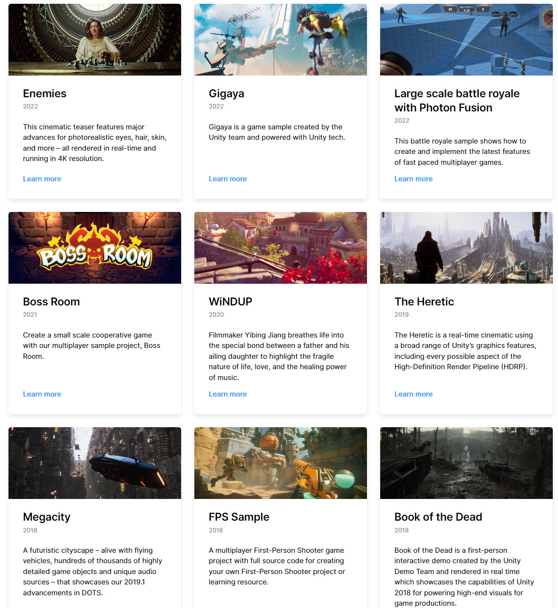
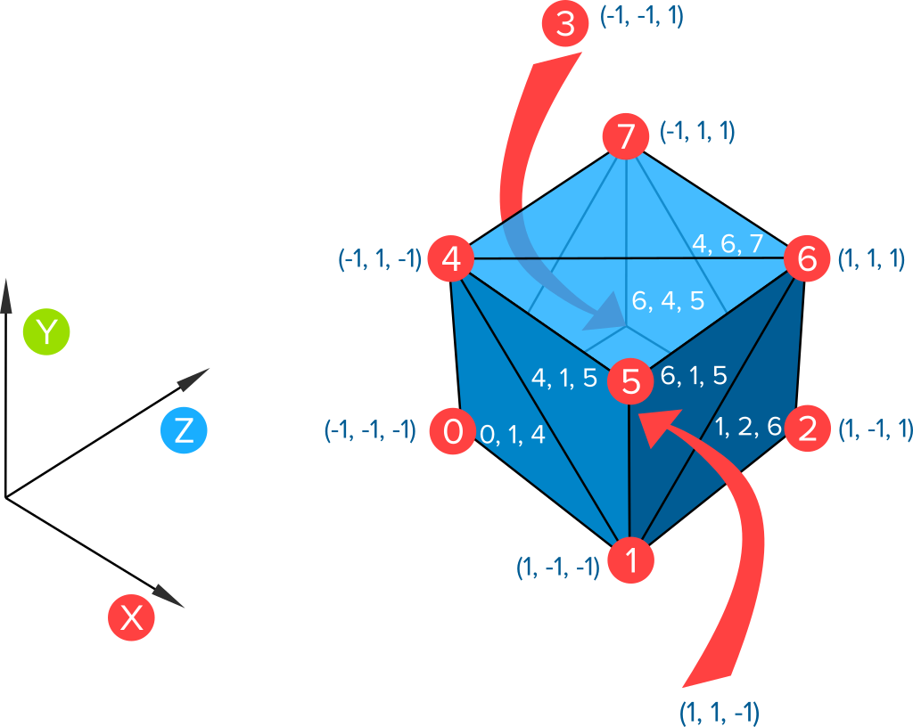

# References

## Resources

## Unity 

### Demos

- [Unity Demo page](https://unity.com/demos)

## ProceduralMeshGeneration

### Basics

- [curved Lines](http://www.code-spot.co.za/2020/11/10/procedural-meshes-for-lines-in-unity/)
- [Circles and half Circles](http://www.code-spot.co.za/2020/11/04/generating-meshes-procedurally-in-unity/)
- [Mesh Generation Normals](http://www.code-spot.co.za/2020/11/25/procedural-meshes-in-unity-normals-and-tangents/)

### CatLikeCoding

- [Cat Like coding Tututorials](https://catlikecoding.com/unity/tutorials/)

### Github Repo

- [Github link](https://github.com/Syomus/ProceduralToolkit)

## Science

[Physical property based materials](https://google.github.io/filament/Filament.md.html)

## Education

- [Aweseom collection of Rambling and Rendering](https://www.vertexfragment.com/ramblings/)

- [HTML Tutorials](https://www.raywenderlich.com/unity)

- [Trello board with everything](https://trello.com/b/Z6cDRyis/good-coding-practices-in-unity-unofficial)

- [Create cars](https://blogs.unity3d.com/2019/02/08/we-have-you-covered-with-the-measured-materials-library/)

## Important

- [UnityMeshGneration](https://github.com/mattatz/unity-teddy)
- [GameDevPatterns](http://gameprogrammingpatterns.com/contents.html)
- [OpenCVExamples](https://enoxsoftware.github.io/OpenCVForUnity/webgl_example/index.html)

## Graphics 

[MeshesArchive](https://casual-effects.com/data/)

[2DArtOpenGameArt](https://opengameart.org/)

### Tools

- Odin
- TopDown Engine
- Game Creator
- ufps
- Adventure Creator
- Lean Touch

## Unity Path Finding

- [GameDevCatalog](http://www-cs-students.stanford.edu/~amitp/gameprog.html)
 

### FX

- [EasyOutline](https://assetstore.unity.com/packages/vfx/shaders/fullscreen-camera-effects/easy-performant-outline-2d-3d-urp-hdrp-and-built-in-renderer-v3--157187)

- [RealisticFxPack](https://assetstore.unity.com/packages/vfx/particles/spells/realistic-effects-pack-4-85675)

### 3D 

[Low Poly Animated People](https://assetstore.unity.com/packages/3d/characters/humanoids/low-poly-animated-people-156748)

[Modula RPG Hero](https://assetstore.unity.com/packages/3d/characters/humanoids/fantasy/modular-rpg-hero-polyart-138600)

## Sales

Web AR Ads boost  sales - [link](https://arinsider.co/2020/09/09/how-can-brands-jumpstart-sales-with-ar-part-ii/)

## OpenCV

[Good OpenCV Watch](https://medium.com/@ravitejajnv/install-opencv-4-0-1-from-source-on-macos-for-conda-virtual-environments-to-use-sift-and-surf-5c62bb21daab)
[Getting the watch](https://pythonprogramming.net/haar-cascade-object-detection-python-opencv-tutorial/)
[KarasNeroNetwork HandTracking](https://github.com/jrobchin/Computer-Vision-Basics-with-Python-Keras-and-OpenCV)
[OpenCV circle detection](https://docs.opencv.org/3.4/d4/d70/tutorial_hough_circle.html)
[OpenCV Python GoodStart](https://pythonprogramming.net/loading-images-python-opencv-tutorial/)

## Google 

TenserFlow Face and Hand Tracking - [link](https://blog.tensorflow.org/2020/03/face-and-hand-tracking-in-browser-with-mediapipe-and-tensorflowjs.html)

[RealTemeAr](https://ai.googleblog.com/2019/03/real-time-ar-self-expression-with.html)

## Links from David

[MyFavorite](https://storage.googleapis.com/tfjs-models/demos/facemesh/index.html)
[TenserFlowJS](https://github.com/pamruta/TensorFlowJS)
[FaceAPI-JS](https://github.com/justadudewhohacks/face-api.js/)
[TutorForFaceMesh](https://www.npmjs.com/package/@tensorflow-models/facemesh) 

## Unity WEB Face tracking

[Unity Web Face Tracking](https://www.banuba.com/blog/unity-ar-foundation-face-tracking-and-banuba-face-ar-compared)

