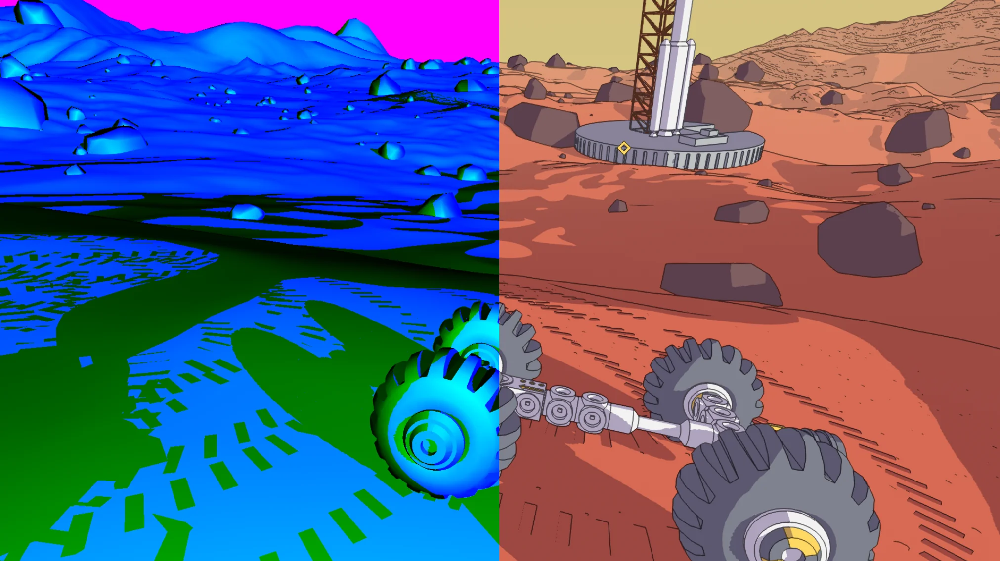
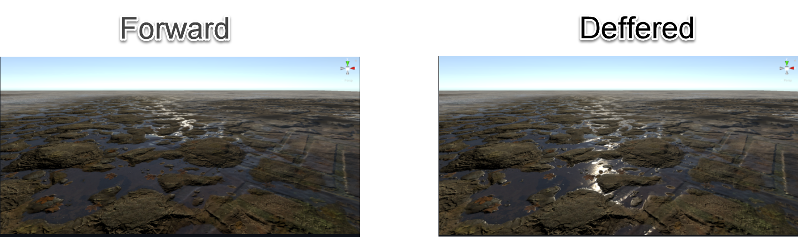
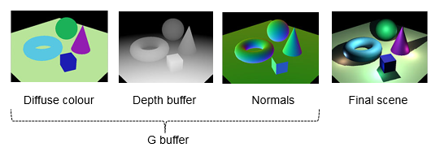
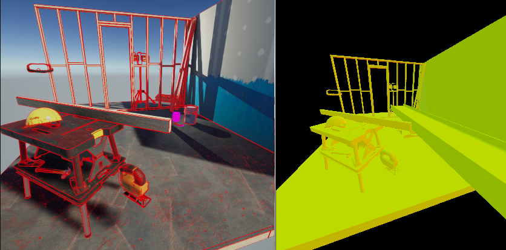

# URP Shaders

## Links

- [What is the right Way to implement single Pass with OpenXR](https://community.khronos.org/t/what-is-the-right-way-to-implement-single-pass-rendering-with-openxr/109157)
- [Random Color per Normal](https://www.reddit.com/r/unity_tutorials/comments/zppa48/random_color_per_normal_using_shader_graph_tut_in/)


- [Mars First Logistics Solution on reedit](https://www.reddit.com/r/Unity3D/comments/taq2ou/improving_edge_detection_in_my_game_mars_first/)


- [Full Screen Outline in Unity](https://github.com/daniel-ilett/shaders-fullscreen-outlines)

## Questions

1. What the diffrence between Cg/HLSL
2. Diffrence between shader types Surface Shader, Unlit Shader, Image Effect Shader, Computer Shader.
3. `CGPROGRAM` and `ENDCG`
5. What is `Pass` and `SubShader`?
6. `Varyings` and `Attributes` what is the diffrence
7. ComputeBuffs ?
8. Shadow Caster Pass - is it a shader or a pass?
9. Passes how can we use them ? What are they?
> Yes
10. Why do we have multiple subshaders in one shader?
> Diffrent version of Unity
12. Some practical tutorial to get close enough experience to write a outline shader
13. What are `RenderFeatures` in URP ?
14. How to make custom `RenderPass` in URP ?
15. For what do we use `GBuffer` Pass ?
16. What is material PassIndex `drawSettings.overrideMaterialPassIndex = -1;`?
17. What does `SetShaderPass`  and ShaderTagId
`drawSettings.SetShaderPassName(0, new ShaderTagId("SRPDefaultUnlit"));`
18. What is that filter and how to use it
```shaderlab
  var filterSettings = new FilteringSettings(RenderQueueRange.all, layerMask: layerMask);

  context.DrawRenderers(renderingData.cullResults, ref drawSettings, ref filterSettings);

```


### New terms

1. `Varyings` vs `Attributes`
2. `ComputeBuffs` 
3. `Render Pass`  - [Custom Render Pass](https://docs.unity3d.com/Packages/com.unity.render-pipelines.universal@12.0/api/UnityEngine.Rendering.Universal.ScriptableRenderPass.html)
4. `Depth Prepass` 
5. `IntermediateTextureMode` - [link](https://docs.unity3d.com/Packages/com.unity.render-pipelines.universal@12.1/api/UnityEngine.Rendering.Universal.IntermediateTextureMode.html)
7. `Render Feature` - [link](https://docs.unity3d.com/Packages/com.unity.render-pipelines.universal@11.0/manual/urp-renderer-feature.html)


## Basics

### Links

- [!!! Japanies URP Render Feature for **SINGLE PASS**](https://tsgcpp.hateblo.jp/entry/2022/03/23/011330)
- [Official Documentation](https://docs.unity3d.com/Packages/com.unity.render-pipelines.universal@11.0/manual/urp-renderer-feature.html)
- [Examples by Unity](https://docs.unity3d.com/Packages/com.unity.render-pipelines.universal@12.0/manual/writing-shaders-urp-basic-unlit-structure.html)
- [URP Edge Detection Outlines]

- 
### Input

#### Terms

- `Properties` - block of variables that can be changed in the editor
- `SubShader` - block of code that can be used in different render pipelines (actually code that is rendered into shader)
- `Pass` - block of code that can be used in different render pipelines
- `Fragment Shader` - code that is executed for each pixel of the mesh
- `Vertex Shader` - code that is executed for each vertex of the mesh
  - Determines final pixel colors and positions.
- `CGPROGRAM` - block of code that is executed in Cg
- `HLSLPROGRAM` - block of code that is executed in HLSL
- `ComputeBuffs` - block of code that is executed in Compute Shader
- Compute shader - is a shader that is executed on GPU
- `Shader_Caster_Pass` - is a pass that is executed for each object in the scene to generate shadow maps


**HLSL** - is a low-level language that is used to write shaders. It is a superset of Cg, which is a superset of GLSL. HLSL is used in DirectX, Cg is used in OpenGL, and GLSL is used in WebGL.

**Cg** - is a high-level language that is used to write shaders. It is a superset of GLSL. Cg is used in OpenGL, and GLSL is used in WebGL.

**Fragment** shader vs **Vertex** shader - the **fragment** shader is executed for each *pixel* of the mesh, while the **vertex** shader is executed for each *vertex* of the *mesh/*.

**Varyings** - are variables that are passed from the vertex shader to the fragment shader. They are used to pass data between the vertex and fragment shaders, such as vertex positions, normals, and texture coordinates.

| Term                      | Acronym |
|---------------------------|---------|
| Universal Render Pipeline | **URP** |
| Render Feature            | **RF**  |
| Single Pass Instanced     | **SPI** |
| Render Texture            | **RT**  |

#### Shader Types


| Fragment Shader Use Cases                               | Vertex Shader Use Cases                                  |
|---------------------------------------------------------| ---------------------------------------------------------|
| 1. Per-pixel lighting calculations                      | 1. Deformation of 3D models (e.g. skinning, morphing)    |
| 2. Advanced texturing techniques (e.g. normal mapping)  | 2. Tessellation and displacement mapping                 |
| 3. Image post-processing (e.g. bloom, blur,outline)     | 3. Procedural geometry generation                        |
| 4. Screen space effects (e.g. reflections, refractions) | 4. Particle systems and vertex animation                 |
| 5. Shader-based fog and atmospheric effects             | 5. Vertex-based ambient occlusion                        |
| 6. Stylized shading (e.g. cel-shading, hatching)        | 6. Implementing custom LOD systems                       |
| 7. Color grading and tone mapping                       | 7. Instancing and GPU culling for optimization           |

## Rendering Path 

### Deffered vs Forwards

- [Defferec Rendering Path Official Manual](https://docs.unity3d.com/Packages/com.unity.render-pipelines.universal@12.0/manual/rendering/deferred-rendering-path.html)



| Feature                             | Forward 🅵                        | Deferred 🅳                                            |
|-------------------------------------|----------------------------------|-------------------------------------------------------|
| Real-time lights per object         | Limited (9 lights) 💡            | Unlimited lights 🌟                                   |
| Normal encoding                     | No encoding (accurate) ✔️         | Two options: 🅰️ Lossy encoding 🅱️ Octahedron encoding   |
| MSAA (Anti-aliasing)                | Supported ✅                     | Not supported ❌                                      |
| Vertex lighting                     | Supported ✅                     | Not supported ❌                                      |
| Camera stacking                     | Supported ✅                     | Limited support (base: Deferred, overlay: Forward) ⚠️  |
| Per-pixel normal encoding           | Ecnoding ❌ (Accurate normal)    | <ul><li>Quantization of normals in G-buffer (loss of accuracy, better performance).</li><li>Octahedron encoding (accurate normals, might have significant performance impact on mobile GPUs).</li></ul>For more information, see the section [Encoding of normals in G-buffer](rendering/deferred-rendering-path.md#accurate-g-buffer-normals). |


**Forward Rendering** 🅵:
- Traditional rendering technique 🏛️
- Processes each object in the scene individually 🖼️
- Calculates lighting for each object, considering all the lights affecting it 🔦
- Can be computationally expensive for complex scenes with many lights ⏳
- Handles transparency and various materials more easily 🌈

**Deferred Rendering** 🅳:
- Modern rendering technique 🌐
- Separates geometry rendering and lighting calculations 🔍
- Renders geometry and material properties into separate buffers (G-Buffer) 📊
- Performs lighting pass using G-Buffer, calculating the contribution of each light 💡
- More efficient for scenes with numerous lights, but struggles with transparency 🌫️


### <a name="render-passes"></a>Deferred Rendering Path render Passes

The following table shows the sequence of Render Pass events in the Deferred Rendering Path.

<table>
    <thead>
    <tr>
        <th>Render Pass events</th>
        <th>Deferred Rendering Path Passes</th>
        <th>SSAO Renderer Feature Passes</th>
    </tr>
    </thead>
    <tbody>
    <tr>
        <td>BeforeRendering</td>
        <td>&#160;</td>
        <td>&#160;</td>
    </tr>
    <tr>
        <td>BeforeRenderingShadows</td>
        <td>&#160;</td>
        <td>&#160;</td>
    </tr>
    <tr>
        <td>AfterRenderingShadows</td>
        <td>&#160;</td>
        <td>&#160;</td>
    </tr>
    <tr>
        <td>BeforeRenderingPrePasses</td>
        <td>Depth, or depth and normal prepass (Forward only materials)</td>
        <td>&#160;</td>
    </tr>
    <tr>
        <td>AfterRenderingPrePasses</td>
        <td>&#160;</td>
        <td>&#160;</td>
    </tr>
    <tr>
        <td>BeforeRenderingGbuffer</td>
        <td>G-buffer Pass (GBufferPass)</td>
        <td>&#160;</td>
    </tr>
    <tr>
        <td>&#160;</td>
        <td>Copy G-buffer depth texture</td>
        <td>&#160;</td>
    </tr>
    <tr>
        <td>AfterRenderingGbuffer</td>
        <td>&#160;</td>
        <td>SSAO (optional)</td>
    </tr>
    <tr>
        <td>BeforeRenderingDeferredLights</td>
        <td>&#160;</td>
        <td rowspan="4"></td>
    </tr>
    <tr>
        <td></td>
        <td>Deferred rendering (stencil)</td>
    </tr>
    <tr>
        <td>AfterRenderingDeferredLights</td>
        <td>&#160;</td>
    </tr>
    <tr>
        <td>BeforeRenderingOpaques</td>
        <td>Opaque Forward-only Materials</td>
    </tr>
    <tr>
        <td>AfterRenderingOpaques</td>
        <td>&#160;</td>
        <td>SSAO and blending (optional)</td>
    </tr>
    <tr>
        <td>BeforeRenderingSkybox</td>
        <td>&#160;</td>
        <td>&#160;</td>
    </tr>
    <tr>
        <td>AfterRenderingSkybox</td>
        <td>&#160;</td>
        <td>&#160;</td>
    </tr>
    <tr>
        <td>BeforeRenderingTransparents</td>
        <td>&#160;</td>
        <td>&#160;</td>
    </tr>
    <tr>
        <td>AfterRenderingTransparents</td>
        <td>&#160;</td>
        <td>&#160;</td>
    </tr>
    <tr>
        <td>BeforeRenderingPostProcessing</td>
        <td>&#160;</td>
        <td>&#160;</td>
    </tr>
    <tr>
        <td>AfterRenderingPostProcessing</td>
        <td>&#160;</td>
        <td>&#160;</td>
    </tr>
    <tr>
        <td>AfterRendering</td>
        <td>&#160;</td>
        <td>&#160;</td>
    </tr>
    <tbody>
</table>

### Relevant code files

This section contains the list of files that contain the code related to the Deferred Rendering Path.

* The main class that handles the Deferred Rendering Path:

    ```
    com.unity.render-pipelines.universal\Runtime\DeferredLights.cs
    ```

* ScriptableRenderPass for the G-Buffer pass:

    ```
    com.unity.render-pipelines.universal\Runtime\Passes\GBufferPass.cs
    ```

* ScriptableRenderPass for the deferred shading pass:

    ```
    com.unity.render-pipelines.universal\Runtime\Passes\DeferredPass.cs
    ```

* Shader asset for the deferred shading:

    ```
    com.unity.render-pipelines.universal\Shaders\Utils\StencilDeferred.shader
    ```

* Utility functions for the deferred shading:

    ```
    com.unity.render-pipelines.universal\Shaders\Utils\Deferred.hlsl
    ```

* Utility functions for storing and loading the Material properties from the G-buffer:

    ```
    com.unity.render-pipelines.universal\Shaders\Utils\UnityGBuffer.hlsl
    ```

## ShaderLab Pass tags

To enable Unity to render a shader in the Deferred Rendering Path, the shader must have a Pass with the following tag definition:

`"LightMode" = "UniversalGBuffer"`

Unity executes the shader with such `LightMode` tag during the G-buffer Pass.

To indicate that Unity must render a certain Material in the Forward-only Pass in the Deferred Rendering Path, add the following tags to a shader Pass:

`"LightMode" = "UniversalForwardOnly"`

`"LightMode" = "DepthNormalsOnly"`

To specify the shader lighting model (Lit, SimpleLit), use the `UniversalMaterialType` tag.

For more information, see the section [URP Pass tags: LightMode](../urp-shaders/urp-shaderlab-pass-tags.md#lightmode).


#### G-Buffer



#### Normals


#### Computer Buffers

> C# Example of creating a ComputeBuffer   
 
```csharp
_buffer = new ComputeBuffer(size, sizeof(float) * 3); // size is the number of Vector3's you want to store, and sizeof(float) * 3 because Vector3 has 3 float values (x, y, z).
```

#### Universal Render Pipeline Shader Libraries

- `Core.hlsl`: This package contains core HLSL functions and definitions that are essential for the Universal Render Pipeline (URP). It includes common math operations, utility functions, and macros that are used across various shader libraries in URP.

- `UnityInput.hlsl`: This package provides functions and structures for handling Unity's input data, such as vertex attributes, interpolators, and uniforms. It simplifies the process of accessing data from meshes and other input sources within shaders.

- `UnityInstancing.hlsl`: This package contains helper functions and definitions for handling GPU instancing in the Universal Render Pipeline. It provides macros and utilities for working with per-instance data and efficiently rendering large numbers of objects with minimal draw calls.

- `UnityLighting.hlsl`: This package includes functions and definitions for working with lighting in the Universal Render Pipeline. It provides support for various lighting models, such as Lambertian (diffuse), Blinn-Phong (specular), and physically-based rendering (PBR), as well as utilities for working with shadows and reflections.

- `UnityPacking.hlsl`: This package contains functions and macros for packing and unpacking data in shaders, such as encoding and decoding normal vectors, colors, and other attributes. These utilities help to optimize memory usage and performance in the Universal Render Pipeline.

- `CommonMaterial.hlsl`: This package, part of the core render pipeline, provides common material properties and functions used across different render pipelines. It includes functions for handling smoothness, metallic, occlusion, and other material properties that are shared between different shading models and pipelines.

- `SurfaceInput.hlsl`: This package defines the SurfaceInput structure, which is used to pass data between the vertex and fragment shaders in URP's surface shaders. It includes fields for vertex attributes such as position, normal, tangent, color, and texture coordinates.

- `ShadowCasterPass.hlsl`: This package contains the shader code for the shadow caster pass in the Universal Render Pipeline. It is responsible for generating shadow maps by rendering objects from the point of view of the light source, taking into account the object's opacity and other shadow-related properties.
 

##### Example
```shaderlab
            #include "Packages/com.unity.render-pipelines.core/ShaderLibrary/CommonMaterial.hlsl"
			#include "Packages/com.unity.render-pipelines.universal/ShaderLibrary/SurfaceInput.hlsl"
			#include "Packages/com.unity.render-pipelines.universal/Shaders/ShadowCasterPass.hlsl"
```
 
#### Top List

Easy applience of custom variables

1. Incide `Properties`
```shaderlab

Properties
{
    [MainColor] _BaseColor("Base Color", Color) = (1, 1, 1, 1)
}
```

2. Incide **HLSL** block 

```shaderlab
            CBUFFER_START(UnityPerMaterial)
                half4 _BaseColor;
            CBUFFER_END 
```

3. Inside `frag()`

```shaderlab
half4 frag() : SV_Target
{
    return _BaseColor;
}
```

### Simple Shader

```shaderlab
// This shader fills the mesh shape with a color predefined in the code.
Shader "Example/URPUnlitShaderBasic"
{
    // The properties block of the Unity shader. In this example this block is empty
    // because the output color is predefined in the fragment shader code.
    Properties
    { }

    // The SubShader block containing the Shader code.
    SubShader
    {
        // SubShader Tags define when and under which conditions a SubShader block or
        // a pass is executed.
        Tags { "RenderType" = "Opaque" "RenderPipeline" = "UniversalPipeline" }

        Pass
        {
            // The HLSL code block. Unity SRP uses the HLSL language.
            HLSLPROGRAM
            // This line defines the name of the vertex shader.
            #pragma vertex vert
            // This line defines the name of the fragment shader.
            #pragma fragment frag

            // The Core.hlsl file contains definitions of frequently used HLSL
            // macros and functions, and also contains #include references to other
            // HLSL files (for example, Common.hlsl, SpaceTransforms.hlsl, etc.).
            #include "Packages/com.unity.render-pipelines.universal/ShaderLibrary/Core.hlsl"

            // The structure definition defines which variables it contains.
            // This example uses the Attributes structure as an input structure in
            // the vertex shader.
            struct Attributes
            {
                // The positionOS variable contains the vertex positions in object
                // space.
                float4 positionOS   : POSITION;
            };

            struct Varyings
            {
                // The positions in this struct must have the SV_POSITION semantic.
                float4 positionHCS  : SV_POSITION;
            };

            // The vertex shader definition with properties defined in the Varyings
            // structure. The type of the vert function must match the type (struct)
            // that it returns.
            Varyings vert(Attributes IN)
            {
                // Declaring the output object (OUT) with the Varyings struct.
                Varyings OUT;
                // The TransformObjectToHClip function transforms vertex positions
                // from object space to homogenous clip space.
                OUT.positionHCS = TransformObjectToHClip(IN.positionOS.xyz);
                // Returning the output.
                return OUT;
            }

            // The fragment shader definition.
            half4 frag() : SV_Target
            {
                // Defining the color variable and returning it.
                half4 customColor = half4(0.5, 0, 0, 1);
                return customColor;
            }
            ENDHLSL
        }
    }
}
```

#### Stereo Shader

```shaderlab
    Properties
    { }

    SubShader
    {
        Tags { "RenderType" = "Opaque" "RenderPipeline" = "UniversalPipeline" }

        Pass
        {
            HLSLPROGRAM
            #pragma vertex vert
            #pragma fragment frag

            #include "Packages/com.unity.render-pipelines.universal/ShaderLibrary/Core.hlsl"
            #include "Packages/com.unity.render-pipeline.core/ShaderLibrary/UnityInstancing.hlsl"

            UNITY_VERTEX_INPUT_INSTANCE_ID

            struct Attributes
            {
                float4 positionOS   : POSITION;
                half3 normal        : NORMAL;
            };

            struct Varyings
            {
                float4 positionHCS  : SV_POSITION;
                half3 normal        : TEXCOORD0;
                UNITY_VERTEX_OUTPUT_STEREO
            };

            Varyings vert(Attributes IN)
            {
                Varyings OUT;
                OUT.positionHCS = TransformObjectToHClip(IN.positionOS.xyz);
                OUT.normal = TransformObjectToWorldNormal(IN.normal);
                UNITY_INITIALIZE_VERTEX_OUTPUT_STEREO(OUT)
                return OUT;
            }

            half4 frag(Varyings IN) : SV_Target
            {
                UNITY_SETUP_INSTANCE_ID(IN)
                half4 color = 0;
                color.rgb = IN.normal * 0.5 + 0.5;
                return color;
            }
            ENDHLSL
        }
    }
  ```
### Show us depth only  



```shaderlab

        Pass
        {
            Name "DepthOnly"
            Tags{"LightMode" = "DepthOnly"}

            ZWrite On
            ColorMask 0

            HLSLPROGRAM
            #pragma only_renderers gles gles3 glcore d3d11
            #pragma target 2.0

            #pragma vertex DepthOnlyVertex
            #pragma fragment DepthOnlyFragment

            // -------------------------------------
            // Material Keywords
            #pragma shader_feature_local_fragment _ALPHATEST_ON

            //--------------------------------------
            // GPU Instancing
            #pragma multi_compile_instancing

            #include "Packages/com.unity.render-pipelines.universal/Shaders/UnlitInput.hlsl"
            #include "Packages/com.unity.render-pipelines.universal/Shaders/DepthOnlyPass.hlsl"
            ENDHLSL
        }

```
