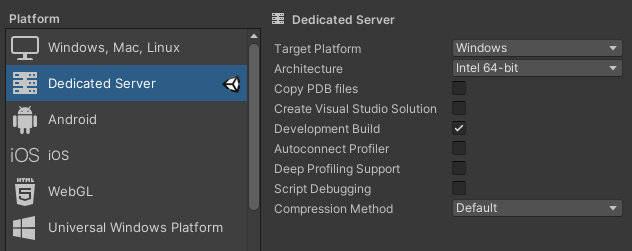

# Unity NetCode

## Resources

- [Unity 2021.2: Dedicated Server target](https://forum.unity.com/threads/unity-2021-2-dedicated-server-target-and-stripping-optimizations-now-live-please-share-feedback.1143734/)
- [Unity Transport Documentation](https://docs.unity3d.com/Packages/com.unity.transport@0.8/manual/TableOfContents.html)
- [Net Code](https://docs.unity3d.com/Packages/com.unity.netcode@0.6/manual/index.html)
- [unity multiplayer github](https://github.com/Unity-Technologies/multiplayer)
- [FPS Samples](https://github.com/Unity-Technologies/FPSSample)
> Unity multiplayer on Github is not the same thing as **MLAPI**
- [NetCode.GameObjects ex (MLAPI)](https://github.com/Unity-Technologies/com.unity.netcode.gameobjects)
- [MLAPI API](https://docs-multiplayer.unity3d.com/docs/mlapi-api/introduction/index.html)
- [MLAPI Samples bitesize](https://github.com/Unity-Technologies/com.unity.multiplayer.samples.bitesize)

## Server Dedicated builds

Dissovered this new features called server target Unity have a blog post how in `2021.2` The dedicate a lot of attention to the servers

	
