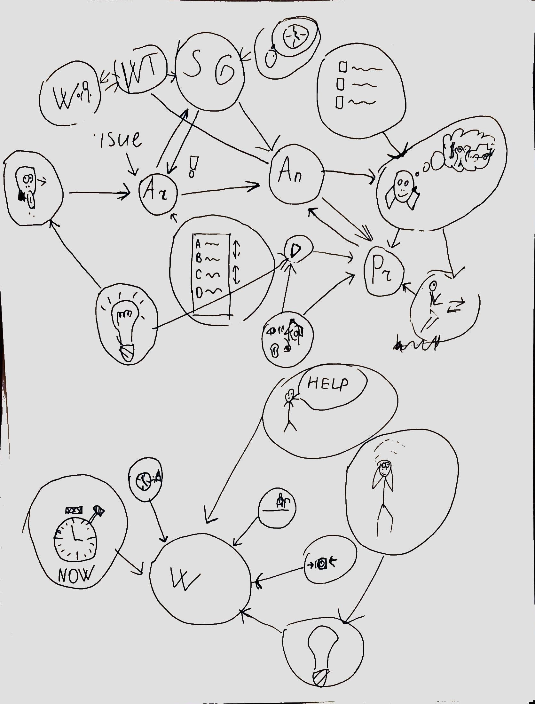
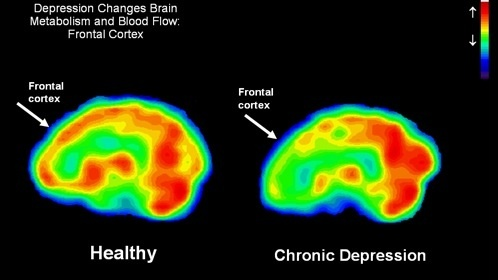

### About brain tion.jpgAnexiety

## Depression

## Ego Deplation 

## Prefrontal cortex functions

### Respansibilties

- Reduce anexiety
- Motivation
- Abstract thinking
- Rewards 
- Education

### Activation
 
- Minfulness
- Focusing attention
- Predictuion the consequences
- Planning

### Exercise

- Put pink glasses
