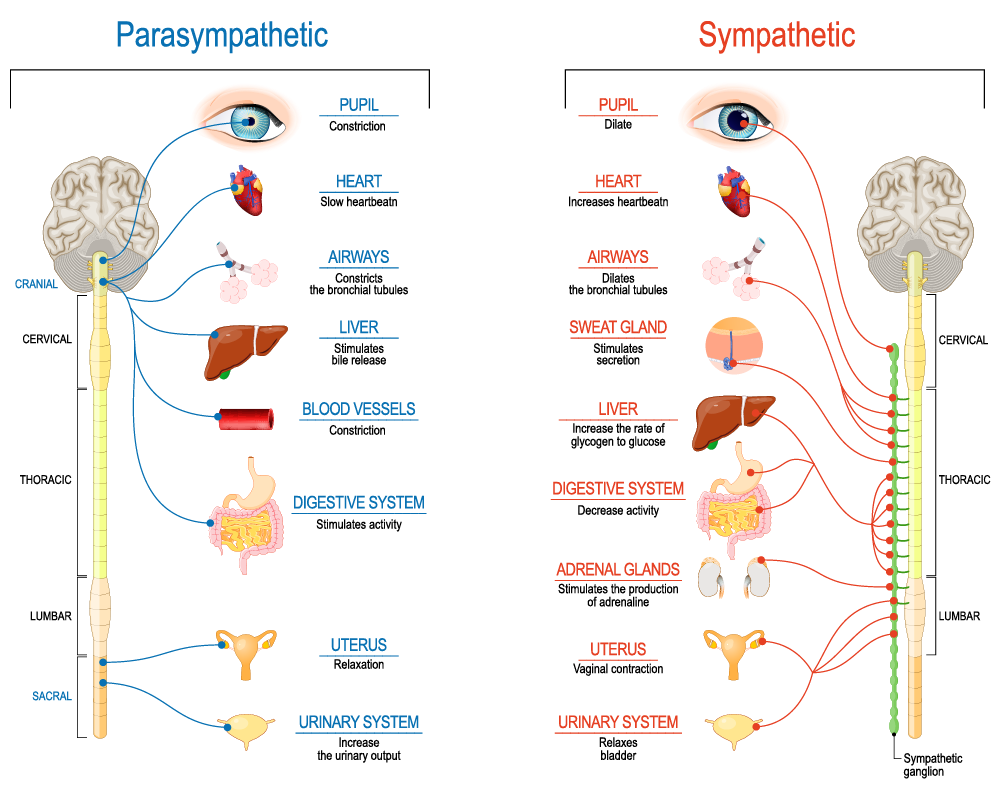

# Brain

## Qustions?

- Box breathing.
- Quck ways to activate Mindfull network.

## Goals

- Nero networks for productivy work.
- Nero envirmoent to get to work.

### About brain 

## Depression

## Anexiety 

## Ego Deplation 

## Prefrontal cortex functions

## Ways to change Network

1. A Detailed strategical planning
2. A Short exercise session(10 push up).

1. B Solving puzzles on HuckerRank 
3. B 10 minutes of making memes.
4. B Making lecture for someone.
5. C Avoiding Dophomine Addictive things.

6. B Box breathing.
8. B Draw in abstract way current Tasks.
9. A Make brainstorm sesion.
10. C Plann to create something 
and to show to somebody **TODAY**.

### Respansibilties

- Reduce anexiety
- Motivation
- Abstract thinking
- Rewards 
- Education

### Activation
 
- Minfulness
- Focusing attention
- Predictuion the consequences
- Planning

### Exercise

- Put pink glasses

